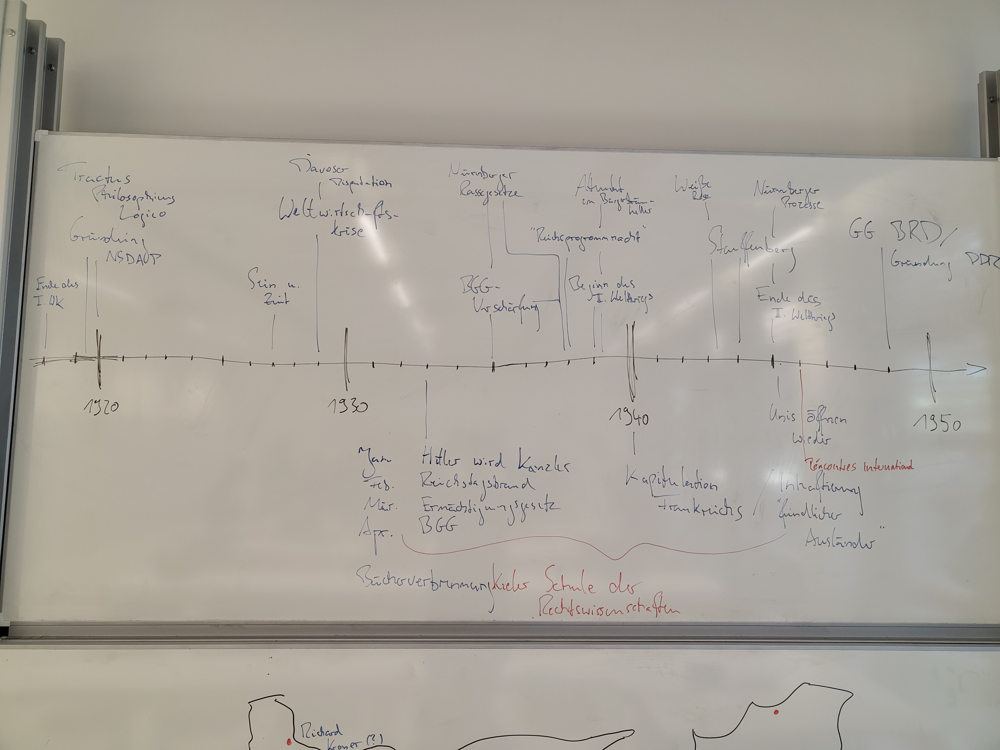
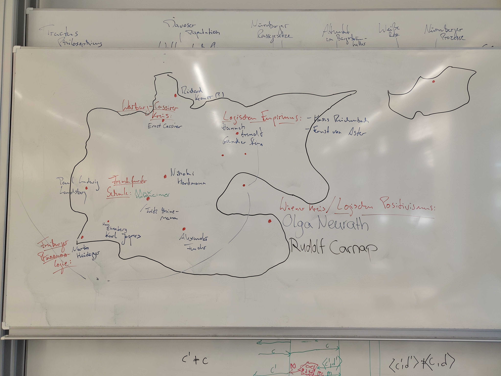
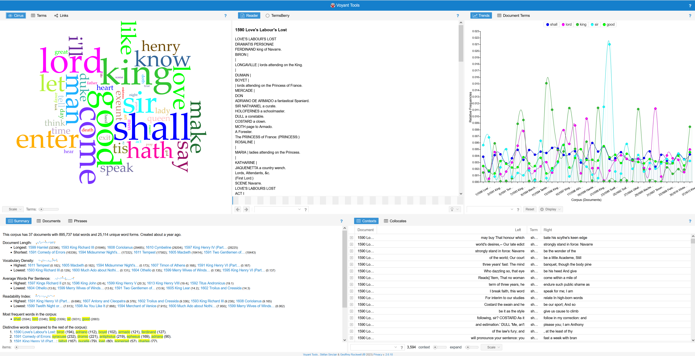

<!--

author: Moritz Riemann, Gregor Große-Bölting
email:  ggb@informatik.uni-kiel.de
version: 0.1
language: en
narrator: UK English Female
-->

# Exil und Haltung – Digital Humanities und Philosophie

**OLAT-Kurs:** https://lms.uni-kiel.de/url/RepositoryEntry/5772148992

**Dozierende:**

* Moritz Riemann (riemann@philsem.uni-kiel.de)
* Gregor Große-Bölting (ggb@informatik.uni-kiel.de)

**Zeit und Raum:** Di 16:15 - 17:45, LMS8 - R.EG.016

**Inhalte und Vorgehen:**

* Interdisziplinäres Arbeiten: Philosophie- und Informatik-studierende arbeiten zusammen und gewinnen Einblick in das andere Fach
* Einblick in die Digital Humanities und grundlegendes Verständnis digitaler Methoden geisteswissenschaftlicher Arbeit
* Arbeit mit X-Technologien, wie XML TEI, ODD, XSLT und RDF
* Praktische Fähigkeiten im Umgang mit Forschungsdaten und im kollaborativen Arbeiten
* Digitale Analyse- und Visualisierungsmethoden für geisteswissenschaftliche Fragestellungen
* Erforschung angemessener Formen interdisziplinär-digitaler Wissenschaft und Universität
* Reflexion der eigenen Fachkultur und der Methoden der Informatik bzw. Digital Humanities

## Organisatorisches

### Leitbild Lehren und Lernen der CAU

[https://www.uni-kiel.de/fileadmin/user_upload/universitaet/profil/cau-leitbild-lehren-und-lehren.pdf](Link auf das Leitbild Lehren und Lernen der CAU)

### Regierungserklärung

1. Diese Veranstaltung ist eine Forschungs**werkstatt**: Wir setzen neue Methoden und Software ein. Seid also nachsichtig mit uns und mit euch selbst, wenn mal etwas nicht funktioniert wie geplant. Lasst uns zeitnah wissen, wenn ihr Probleme habt, dann findet sich für alles eine Lösung!
2. Das Seminar wird sich voraussichtlich für Philosophiestudierende nicht wie eine Philosophieveranstaltung und für Informatikstudierende nicht wie eine Informatikveranstaltung anfühlen.
3. Ihr dürft (und sollt) gerne eigene Tools und Ideen einbringen! Der Seminarplan ist auch offen für Eure Vorschläge.
4. Interdisziplinarität lebt von wechselseitiger Verständlichkeit: Redet mit uns und mit Euren Mitstudierenden, wenn ihr Dinge nicht versteht oder Hilfe braucht.
5. Wir erwarten von euch, dass ihr euch zwischen den Sitzungen mit den Seminarinhalten befasst (Texte lest, Aufgaben erledigt) und zu den Präsenzsitzungen anwesend seid. Im Gegenzug unterstützen wir euch, wo wir können und machen Zugeständnisse, falls die Arbeitsbelastung zu groß werden sollte. 
6. Der Seminarplan ist "im Fluss".

### Semesterplan

| Datum | Thema/Inhalt | Protokoll |
|-------|--------------| --------- |
| 14.04. | Begrüßung, Einführung in das Thema, Überblick über das Semester | - | 
| 21.04. | **I. Exil und Haltung.** Was ist Haltung? Philosophische Annäherung | Momme |
| 28.04. | Philosophie zu Beginn des 20. Jahrhunderts und Exil von Philosoph:innen: geschichtlicher Hintergrund | Tom |
| 05.05. | Haltung am Beispiel: Paul Ludwig Landsberg | Jonas |
| 12.05. | Vertiefung, Referate | Jakob |
| 19.05. | **II. Digital Humanities.** Was sind und was machen die Digital Humanities? | Valeriia |
| 26.05. | Beispiel I: Heinrich Blüchers Vorlesungen im Exil / statistische Auswertung von Texten | Jeremy |
| 02.06. | Beispiel II: Das Briefnetzwerk von Lotte Labowsky, Gertrud Bing und Raymond Klibansky / automatische Texttranskription und TEI XML | Jan-Lukas |
| 09.06. | Beispiel III: Ein Verzeichnis geflohener Philosophinnen / RDF und *knowledge graphs* | Elina |
| 16.06. | **III. Praxisteil / Projektphase.** Recherche(methoden) und mögliche Quellen | Julius |
| 23.06. | Methode: Philosophische Podcasts und das Schreiben eines Skripts |   |
| 30.06. | Arbeitssitzung |   |
| 07.07. | Vertiefung, tba | - |

### Forschungs(daten)zyklus

#### ScanTent

#### Transkribus

#### TEI XML: Datenannotation

#### Analyse: Netzwerke, Zeitverläufe, GIS

### Prüfungsleistung

**Für Informatiker_innen:**

* "Sitzungsprotokoll" (10%)
* Skript und Podcast (je 30%)
* Peer Review (10%)
* schriftl. Reflexion (20%)

Alle Teilleistungen müssen für eine erfolgreiche Gesamtteilnahme eingereicht und bestanden werden. 

**Für Philosoph_innen:**

Jede der Prüfungsformen beinhaltet die gemeinsame Präsentation in einer Kleingruppe am Ende des Semesters.

* Referate: bitte frühzeitig melden!
* Podcast (nur für BA7 und BA8)
* Essay
* Hausarbeit

---

Mögliche Referats- und Podcastthemen:

* Sozialgeschichte der Philosophie
* Warburg-Kreis
* Cassirer 
* Porträt: Labowsky, Bing, Klibansky / Verhältnis von Philosophie und Philologie 
* ... sprecht uns an!

#### Hinweise zum "Sitzungsprotokoll" (für Informatiker_innen)

**Aufgabenstellung:** Sprecht mit Gregor eine Sitzung ab, für die ihr ein "Sitzungsprotokoll" anfertigt. Das Protokoll soll die wichtigsten Ergebnisse und Erkenntnisse der Sitzung festhalten (nicht den Verlauf) und dient als Ergänzung bzw. Erweiterung des Kursmaterials, sprich: Die "Protokolle" werden direkt in das Material übernommen und dienen als gemeinsame Ressource für alle zur Nachbereitung des Seminars. Entsprechend sollte das Protokoll so aufbereitet sein, dass ein Nicht-Anwesender Studierender sich anhand der Notizen im Nachhinein ein klares Bild davon machen kann, welche Inhalte in der entsprechenden Woche besprochen wurden. 

Das Protokoll muss bis **spätestens zwei Wochen** nach der Sitzung per E-Mail (ggb@informatik.uni-kiel.de) oder [pull request]() bei mir eingereicht werden.

Weitere Formalia:

* min. 500 Wörter (etwa eine DIN A4-Seite)
* Das Dokument ist in Markdown abgefasst (noch besser: es verwendet die [LiaScript-Syntax](https://liascript.github.io/course/?https://raw.githubusercontent.com/liaScript/docs/master/README.md#1))
* Falls externe Quellen oder Literatur verwendet wurden, müssen diese gemäß eines üblichen Zitationsstandards (APA, IEEE, ACM, etc.) angegeben werden (bevorzugt: APA)
* Falls ChatGPT o. ä. verwendet wurden: Umfang und Prompts angeben 

Für eine ausreichende (oder bessere) Arbeit

* Besitzt der eingereichte Text eine klare Struktur, die durch Markdown kenntlich gemacht wird
* Wurde eine Rechtschreib- und Grammatikprüfung durchgeführt
* Werden die wichtigsten Themen, Begriffe, etc. der Woche aufgeführt

Eine gute (oder bessere) Arbeit

* Ist verständlich geschrieben und besitzt einen deutlichen, roten Faden
* Bezieht die fachliche Expertise Mitstudierender aus der Philosophie mit ein 
* Nennt und verarbeitet Quellen, die über die Seminarliteratur hinausgehen
* Integriert sich nahtlos in das existierende LiaScript-Material für die Sitzung

Das LiaScript-Material findet ihr in diesem GitHub-Repository: tba

Um das Material zu erweitern, könnt ihr das Repo forken und eine Pull Request stellen.

#### Hinweise zur Peer Review (für Informatiker_innen)

**Aufgabenstellung:** tba

Das Protokoll ist **bis spätestens zum tba** per E-Mail (ggb@informatik.uni-kiel.de) bei mir als PDF einzureichen.

Weitere Formalia:

* 300 Wörter (+/- 20%), etwas weniger als eine DIN A4-Seite. Bitte gebt die Anzahl der Wörter am Ende des Dokuments an.
* Name, stu-Mailadresse
* Unterschriebene Eigenständigkeitserklärung
* Falls externe Quellen oder Literatur verwendet wurden, müssen diese gemäß eines üblichen Zitationsstandards (APA, IEEE, ACM, etc.) angegeben werden
* Falls ChatGPT o. ä. verwendet wurden: Umfang und Prompts angeben (ich rate von der Verwendung ab, da es sich um eine Reflexion der eigenen Erfahrungen mit dem Tool handeln soll)

Für eine ausreichende (oder bessere) Arbeit

* Besitzt der eingereichte Text eine klare Struktur
* Wurde eine Rechtschreib- und Grammatikprüfung durchgeführt
* Der Text wertschätzend und konstruktiv verfasst
* Ein "problematischer" Aspekt identifiziert

Eine gute (oder bessere) Arbeit

* Ist verständlich geschrieben und besitzt einen deutlichen, roten Faden
* Mehrere verbesserungswürdige Aspekte identifiziert
* Lösungsmöglichkeiten für die Aspekte benannt

#### Hinweise zum Skript / Podcast (für Informtiker_innen)

**Aufgabenstellung:** tba

#### Hinweise zur Reflexion (für Informatiker_innen)

**Aufgabenstellung:** tba

Die Ausarbeitung muss bis zum **30. September 2026** (Ende des Semesters) per E-Mail (ggb@informatik.uni-kiel.de) bei mir als PDF eingereicht werden.

Weitere Formalia:

* 1.000 Wörter im einspaltigen [ACM-Template](https://www.acm.org/publications/proceedings-template), bevorzugt in LaTeX ([Overleaf](https://www.rz.uni-kiel.de/de/angebote/software/overleaf/overleaf))
* Name, stu-Mailadresse
* Unterschriebene Eigenständigkeitserklärung
* Externe Quellen sind gemäß der ACM-Zitierweise anzugeben; das Literaturverzeichnis zählt nicht zur Gesamtlänge
* Falls ChatGPT o. ä. verwendet wurden: Umfang und Prompts angeben (zählt nicht zur Gesamtlänge)
* Die Arbeit kann auf Deutsch oder Englisch verfasst werden

Für eine ausreichende (oder bessere) Arbeit

* tba

Eine gute (oder bessere) Arbeit

* tba

### Hinweise zu Podcasts 

Umfangreiche Hinweise zur Erstellung von Podcasts als Prüfungsleistung findet ihr im [folgenden Leitfaden](https://liascript.github.io/course/?https://raw.githubusercontent.com/mauriemann/Podcast/main/Podcast_main.md).

## Sitzung am 14.04. 

### "Speed Dating"

Sprecht mit der Person, die euch gegenübersitzt, zwei Minuten über die folgenden Fragen:

1. Warum studiert Ihr Eure Disziplin?
2. Was bewundert Ihr an der jeweils anderen Disziplin?
3. Welche einflussreichen Frauen (Philosophinnen, Informatikerinnen) kennt ihr in eurer Disziplin?

Wenn das Signal gegeben wird, rücken diejenigen, die mit dem Rücken zum Eingang/Front sitzen, einen Platz nach links.

Diejenigen die außen sitzen wechseln die Reihe und füllen den leeren Platz in der nächsten Reihe auf usw.

### Wie liest man philosophische Texte?

Philosophische Texte sollten bzw. können nicht wie andere Texte gelesen werden: Sie müssen eingeordnet und verstanden werden, das Textverständnis erfordert eine aktive Auseinandersetzung. Rosenberg (1984) macht sechs verschiedene Vorschläge, wie man eine:n Philosoph:in lesen kann:

>1. Sie können einen Philosophen auf seine Resultate hin lesen 
>2. Sie können einen Philosophen auf seine Argumente hin lesen 
>3. Sie können einen Philosophen in seinem dialektischen Zusammenhang lesen 
>4. Sie können einen Philosophen kritisch lesen
>5. Sie können einen Philosophen auf die Entscheidung eines Problems hin lesen
>6. Sie können einen Philosophen kreativ lesen 
>
> (Rosenberg, 1984)

Der vollständige Text mit einer Erläuterung, was es mit den einzelnen Thesen auf sich hat, findet sich im [OLAT-Materialverzeichnis](https://lms.uni-kiel.de/auth/RepositoryEntry/5772148992/CourseNode/113529231322421/path%3D~~Texte/0). 

### Zur nächsten Sitzung

Lest zur folgenden Sitzung (im OLAT Materialverzeichnis zu finden):

* Grimm, Keber, Zöllner: Haltung im digitalen Zeitalter. Wie wir der Welt begegnen (2019).
* Frauke Kurbacher: Interpersonalität zwischen Autonomie und Fragilität (2017).

Lest den Text aufmerksam auf folgende Fragen hin:

1. Welche Anschlusspunkte zum Leitbild Lehren und Lernen (Haltung) findet Ihr in den Texten?
2. Wo seht ihr Bezüge zwischen den Texten?
3. Was ist im ethischen Sinne eine Haltung?
4. Wie viel Mut kostet es eine Haltung zu vertreten? Was können Widerstände sein? 
5. Wie kann man Haltung praktisch umsetzen?

## Sitzungsprotokoll am 21.04. 

### Erster Eindruck der Texte

Der Text aus Digitale Ethik von Grimm, Keber und Zöllner wurde in der Gruppe ganz gut aufgenommen. Er liest sich wie ein "normaler" Sachtext und hat viele Beispiele aus der digitalen Welt. Der Kurbacher-Text wirkte dagegen erstmal überfordernd und vage. Es war für viele schwer, eine klare Kernaussage aus dem Text abzuleiten.

Anschließend hatten wir eine kurze Diskussion über den Begriff Interpersonalität, der bei Kurbacher zentral ist. Für den Moment haben wir ihn als den Austausch zwischen Personen verstanden, also das "Dazwischen", in dem man sich auf andere bezieht und umgekehrt.

#### Ergebnis der Leitfragen aus Kleingruppen und Plenum

##### Frage 1: Anschlusspunkte zum Leitbild Lehren und Lernen

Beide Texte legen nahe, dass Bildung mehr ist als reine Wissensvermittlung. Es geht auch um
Persönlichkeitsbildung, Urteilsfähigkeit und Verantwortung. In der Praxis ist das aber nicht so leicht
umzusetzen: Vorlesungen mit 300 Studierenden lassen wenig Raum für so etwas wie echte
Haltungsbildung, direkten Austausch und die Uni hat natürlich nur begrenzte Mittel (Dozierende,
Übungen, Räume etc.) und will die möglichst optimal nutzen.
Kritisch haben wir dazu angemerkt, dass im Leitbild der CAU zwar eine bestimmte Haltung
eingenommen wird, aber kaum Begründungen und Raum für Diskurs dafür gegeben werden.

##### Frage 2: Bezüge zwischen den Texten

Beide Texte nehmen die Selbstreflexion stark in den Fokus und betonen, dass Haltung sich immer auf
etwas beziehen muss. Im ersten Text (Zöllner) geht es dabei eher um den Bezug zu aktuellen
Geschehnissen in der digitalen Welt. Beide zielen im Grunde aber darauf, Haltung als einen
relationalen Begriff zu verstehen, also als etwas, das man in interpersoneller Bezüglichkeit auslebt.

##### Exkurs: Gesinnung vs. Haltung

Während Frage 2 sind wir ein Stück weit abgeschweift zu der Frage, was eigentlich der Unterschied
zwischen Gesinnung und Haltung ist. Wir sind zu dem Ergebnis gekommen, dass Gesinnung eher
etwas ist, dass man von anderen übernimmt (Familie, Umfeld, Gesellschaft). Währenddessen Haltung
stärker aus einem selbst kommt. Mit der Haltung wächst ein eigenes Wertekonstrukt, welches
wiederum durch interpersonellen Austausch wächst.

##### Frage 3: Was ist im ethischen Sinne eine Haltung?

Bei Zöllner ist der zentrale Gedanke, dass Haltung sich im Handeln zeigt, nicht nur im Reden und sie
beinhaltet den Einsatz für ein respektvolles Miteinander. Ein Kommilitone aus der Philosophie hielt
fest: „Ethik ist die Theorie, Haltung ist die Praxis, die die Theorie mit eigenen Erfahrungen und
Erlebnissen kombiniert.“

Bei Kurbacher ist die zentrale Figur das Wechselspiel zwischen Autonomie und Fragilität. Daran hängt
die Frage: Was wird aus meiner Haltung, wenn ich in Umstände gerate, die diese schwächen? Zum
Beispiel bei Krankheit oder wenn ich aus meinen sozialen Bezügen herausgenommen werde. Genau
hier haben wir den Bogen zum Seminarthema Exil geschlagen: Wenn ich meinen gewohnten Raum
verlasse, bin ich erstmal fragil, weil viel neu ist.

„Darin verstehe ich Haltung sehr grundsätzlich als Bezüglichkeit, die fragile wie autonome Aspekte
unserer menschlichen Existenz in ihrer Problematik wie Potentialität umgreift" (Kurbacher, 2016,
S.145). Eine richtig knappe und präzise Definition liefert Kurbacher selbst nicht und begründet dies
auch (vgl. Kurbacher, 2016, S.11).

##### Frage 4: Wie viel Mut kostet eine Haltung? Widerstände?

Als erstes haben wir konkrete Beispiele gesammelt. Ein naheliegendes war KI: Wenn ich auf KI-Tools
angewiesen bin, weil ich sonst im Studium, oder aber im Job den Anschluss verliere nutze ich sie
dann, obwohl ich es eigentlich nicht möchte, oder bleibe ich standhaft?

Gregor hat dazu zwei reale Fälle eingebracht: einmal Google und das US-Verteidigungsministerium,
wo Google-Mitarbeiter gegen die Kooperation gestreikt haben, und einen aktuellen Fall mit Anthropic
und einem US-Ministerium. Außerdem haben wir auf den Mut zum Widerstand gegen das NS-Regime
hingewiesen, der natürlich eine ganz andere Größenordnung hatte. Dies wird in den kommenden
Sitzungen aber noch weiter thematisiert.

Die Gruppe ist zu dem Schluss gekommen, dass Haltung zu zeigen sowohl viel als auch wenig Mut
kosten kann. Nach Kurbacher ist eigentlich jede interpersonelle Handlung schon Teil einer Haltung.
Insofern leben wir Haltung im Alltag ständig aus, oft ohne groß darüber nachzudenken. Schwierig
wird es dann, wenn Angst, Abhängigkeit, Bequemlichkeit oder einfach die schiere Komplexität der
(digitalen) Welt dazukommen. Gerade im Digitalen ist es oft kaum durchschaubar, was die eigenen
Handlungen bewirken und genau das hemmt oder hindert uns, Haltung zu zeigen (vgl. Zöllner, 2019,
S.219).

##### Frage 5: Wie kann man Haltung praktisch umsetzen?

Zu Frage 5 sind wir nicht gekommen. Diese wird nächste Woche noch einmal besprochen.
Kurzes Fazit

Der für mich wichtigste Punkt der Sitzung: Haltung ist nichts, was man einmal hat und dann für
immer ist. Beide Texte zeigen aus verschiedenen Richtungen, dass Haltung sich im Tun zeigt und auf
Beziehungen angewiesen ist. Genau deshalb ist sie im Kontext Exil so interessant. Wer seinen
gewohnten Rahmen verliert, verliert erstmal auch das, was seine Haltung bisher getragen hat, und
muss sie dann neu finden oder neu verteidigen.

### Literatur

* Grimm, P., Keber, T. O., & Zöllner, O. (2019). Digitale Ethik. Leben in vernetzten Welten. Reclam.
* Kurbacher, F. A. (2016). Interpersonalität zwischen Autonomie und Fragilität. Grundzüge einer Philosophie der Haltung. In F. A. Kurbacher & P. Wüschner (Hrsg.), Was ist Haltung? Begriffsbestimmung, Positionen, Anschlüsse (S. 145–162). Königshausen & Neumann.

### Zur nächsten Sitzung

Recherchiert: Welche philosophischen Strömungen und Schulen gab es im deutschsprachigen Raum zu Beginn des 20. Jahrhunderts. Welche Philosophen waren im gleichen Zeitraum tätig, wer musste Deutschland aufgrund des Nationalsozialismus verlassen? Wer ist zurückgekehrt?

Bitte lest außerdem:

* Hans Jörg Sandkühler: Vergessen? Verdrängt? Erinnert? Philosophie im Nationalsozialismus. In. Ders.: Philosophie im Nationalsozialismus (Einleitung aus dem im OLAT hinterlegten Buch)
* (Optional) Lars Lambrecht: Vom ›Geist unbefangener Menschlichkeit‹ Hannah Arendt und Karl Jaspers als Beispiele kritischer Haltung in der Zeit des Nationalsozialismus. In: Hans Jörg Sandkühler: Philosophie im Nationalsozialismus.

## Sitzungsprotokoll am 28.04.

### Vorbereitung und Leitfragen

Zur Vorbereitung auf diese Sitzung war zu recherchieren, welche philosophischen Strömungen und Schulen im deutschsprachigen Raum zu Beginn des 20. Jahrhunderts tätig waren. Außerdem war zu recherchieren, wer Deutschland aufgrund des Nationalsozialismus verlassen musste und wer anschließend zurückkehrte. Zudem war die Einleitung von Hans Jörg Sandkühler "Vergessen? Verdrängt? Erinnert?" zu lesen.

### 1. Historischer Rahmen

Zur Verortung wurde gemeinsam eine Zeitleiste der für die Fragestellung zentralen Daten erarbeitet:

- **1918** Ende des Ersten Weltkriegs
- **1920** Gründung der NSDAP
- **1921** Wittgenstein, *Tractatus logico-philosophicus*
- **1927** Heidegger, *Sein und Zeit*
- **1929** Weltwirtschaftskrise; **Davoser Disputation** zwischen Ernst Cassirer und Martin Heidegger
- **1933** Hitler wird Reichskanzler; Reichstagsbrand und Reichstagsbrandverordnung (27./28.02.); Ermächtigungsgesetz; **Gesetz zur Wiederherstellung des Berufsbeamtentums (BBG)** im April; Bücherverbrennungen
- **1935** Nürnberger Rassengesetze
- **1938** Reichspogromnacht
- **1939** Beginn des Zweiten Weltkriegs; Georg-Elser-Attentat; mit Kriegsbeginn werden jüdische Geflüchtete nicht mehr nur als „jüdische Ausländer", sondern auch als „feindliche Ausländer" eingestuft → Inhaftierung in den Aufnahmeländern
- **1940** Kapitulation Frankreichs
- **1944** Stauffenberg-Attentat
- **1945** Kriegsende; Nürnberger Prozesse; ab Wintersemester 1945/46 öffnen die Universitäten wieder
- **1946** *Rencontres internationales de Genève*
- **1949** Grundgesetz und Gründung der DDR

**Stellung von Frauen in der Wissenschaft:** Im Kaiserreich waren die Universitäten zwar stark finanziert, Frauen jedoch faktisch von der Lehre ausgeschlossen; die Weimarer Republik finanzierte die Hochschulen schwächer, eröffnete Frauen aber erstmals den Zugang zur akademischen Lehre.

### 2. Strömungen, Schulen und Akteure

Im Plenum wurden zentrale philosophische Schulen und ihre Vertreter ihren Wirkungsorten zugeordnet:

- **Frankfurter Schule** (Frankfurt a. M.): Max Horkheimer, Theodor W. Adorno – ihre marxistisch geprägte Theoriebildung machte sie aus Sicht des Regimes zu einem besonderen Feindbild.
- **Wiener Kreis – logischer Positivismus** (Wien): Otto Neurath, Rudolf Carnap.
- **Logischer Empirismus** (Berlin): Hans Reichenbach, Günther Stern.
- **Warburg-Kreis** (Hamburg): Ernst Cassirer.
- **Kiel:** Richard Kroner wurde 1934 als Professor entfernt.
- **Göttingen:** Nicolai Hartmann.
- **Heidelberg:** Karl Jaspers, Hans Ehrenberg.
- **Bonn:** Paul Ludwig Landsberg.
- **München:** Alexander Pfänder.
- **Freiburg:** Martin Heidegger – NSDAP-Mitglied und einer der ersten prominenten Philosophen, die das Regime öffentlich unterstützten.
- **Berlin:** Hannah Arendt.
- **Gießen:** Ernst von Aster.

### 3. Exil

Mit dem BBG (April 1933) begann die systematische Entfernung jüdischer und politisch missliebiger Hochschullehrer aus den Universitäten. Beliebte erste Exilländer waren **Belgien, die Niederlande und die Schweiz**. Mit Kriegsbeginn 1939 verschärfte sich die Lage. Die Umkategorisierung jüdischer Geflüchteter zu „feindlichen Ausländern" führte in den Aufnahmeländern zu Inhaftierungen, die viele zur weiteren Flucht zwangen.

### 4. Rückkehr

Eine Liste aller Rückkehrer wurde nicht erstellt. Allerdings haben wir zwei zentrale Punkte festgehalten. Die **Wiederöffnung der Universitäten ab dem Wintersemester 1945/46** und die **Rencontres internationales de Genève (1946)** markieren den Wiederbeginn des intellektuellen Austauschs nach dem Krieg. Die Wiederöffnung der Universitäten ab dem Wintersemester 1945/46 vollzog sich unter den Bedingungen der alliierten Entnazifizierungspolitik. Viele Lehrstühle waren durch Entlassungen und Kriegseinwirkungen unterbesetzt. Sie mussten neu besetzt werden, teils durch Personen, die bereits unter dem Regime gelehrt hatten und nun politisch überprüft wurden. Teilweise aber auch durch zurückgekehrte Personen.

### 5. Eindrücke vom Text

Aus der Lektüre der Sandkühler-Einleitung wurden in der Diskussion drei Punkte besonders hervorgehoben:

- **Karl Mannheim:** Die im Text herangezogenen Aussagen Mannheims blieben für uns deutungsoffen und wurden als zu klärende Stelle für die weitere Auseinandersetzung notiert.

- **Der Fall Landsberg:** Paul Ludwig Landsberg musste fliehen, wurde aber zugleich vom Regime positiv erwähnt. Dieses Beispiel macht deutlich, dass Verfolgung und ideologische Vereinnahmung nicht gegeneinander stehen müssen.

- **Vorsicht bei Universitätsaussagen unter Diktaturen:** Sandkühlers Mahnung, dass Aussagen aus Universitäten unter einer Diktatur kritisch zu lesen sind, weil Diktaturen die Seele verändern, wurde als zentrale methodologische Leitlinie festgehalten. Im Nachhinein lässt sich nur schwer feststellen, wer wirklich ideologisch überzeugt war und wer sich aus Anpassung entsprechend äußerte.

### Zur nächsten Sitzung

Bitte bereitet für die Sitzung am 05.05. aus Landsbergs "Einführung in die Anthropologie" (1934) die Seiten 9 bis 30, für den 12.05. die Seiten 74 bis 96 vor (beide Abschnitte findet ihr im gleichen Dokument). Zudem dient der Text Geist im Exil von Eduard Zwierlein (2009) als Hintergrund für beide Sitzungen; er ist länger, aber deutlich einfacher zu lesen und geht auf die Biographie von Paul Ludwig Landsberg und seinen Weg in und durch das Exil ein. 

## Sitzungsprotokoll 05.05.

### Wer war Paul Ludwig Landsberg?

Paul Ludwig Landsberg war einer von vielen deutschen Philosophen mit jüdischer Herkunft, die zur Zeit des Nationalsozialismus aus Deutschland fliehen mussten (ULB, 2024). Landsberg, der in einem gebildeten Elternhaus aufwuchs, begeisterte sich bereits in jungem Alter für die Philosophie, insbesondere für den marxistischen Sozialismus und vertrat seine Haltung ebenfalls nach außen. Ein wichtiger Mentor war sein philosophischer Lehrer Max Scheler, der ihn während seiner Karriere oft zur Seite stand. Nach der Schule studierte er zuerst 1920/21 in Freiburg, wo er unter anderem Martin Heidegger kennenlernte. Paradoxerweise war Landsberg zur Lebenszeit mit mehreren deutschen Philosophen, z.B. Heidegger und Erich Rothacker in Kontakt gestoßen, die später während des Nationalsozialismus das Regime aktiv unterstützten, zu ihm allerdings noch nach dem Ende des Zweiten Weltkrieg engen Kontakt pflegten (Peter, 2018; ULB, 2025). Nach einem weiteren Universitätsaufenthalt von 1921 bis 1923 in Köln ging Landsberg nach Berlin. Der Tod seines Vaters 1927 und der Tod Max Schelers 1928 trafen Landsberg schwer. Diese Ereignisse könnten Landsberg unter anderem später zu seiner philosophischen Anthropologie inspiriert haben, um der Bestimmung des Menschen näher zu kommen. 1928 habilitierte er an der Universität Bonn und lehrte dort ab 1929 als Privatdozent. 1932 war sein Entwurf "Einführung in die philosophische Anthropologie" fertig, dessen Veröffentlichung 1934 erst zu seiner Exilzeit stattfand. Denn nachdem er die NSDAP kritisierte und aufgrund dessen unter Beobachtung stand, entschied er sich 1933 frühzeitig in die Schweiz und danach nach Frankreich zu fliehen. 1934 migrierte er stets mit seiner Frau weiter nach Spanien, um dort erneut als Professor in Barcelona zu lehren. Um den sich anbahnenden Bürgerkrieg in Spanien zu umgehen, begab sich Landsberg 1936 nach Paris. Nach der Besetzung Frankreichs durch die Nationalsozialisten wurde Landsberg 1943 von der Gestapo festgenommen und in das KZ Oranienburg-Sachsenhausen verschleppt, wo er bis zu seinem Tod 1944 verblieb. Zu seiner Zeit auf der Flucht blieb Landsberg trotz schwerer Schicksalsschläge stets optimistisch und aufrecht. Paul Ludwig Landsberg ist in Deutschland nach seinem Tod bis heute relativ unbekannt geblieben. (Zwierlein, 2009)

### Philosophische Anthropologie

#### Geschichte

Die philosophische Anthropologie beschäftigt sich mit der Selbstauffassung des Menschen und untersucht, was der Mensch ist und wozu er bestimmt ist (Landsberg, 1934). Mit der philosophischen Anthropologie beschäftigte sich bereits Aristoteles, der erkannte, dass der Mensch Vernunft besitzt und sich dadurch als Wesen vom Tier unterscheidet. Anfang des 20. Jahrhunderts begannen deutsche Philosophen, u.a. Landsberg, Scheler, Gehlen erneut sich mit der philosophischen Anthropologie zu beschäftigen.  

#### Philosophische Anthropologie nach Landsberg

Landsberg hält fest, dass jede (un)bewusste Beschäftigung mit dem Menschen immer aus einer spezifischen Perspektive mit einer Vorstellung geschieht. Außerdem unterscheidet er zwischen Merkmals- und Wesensanthropologie. (Landsberg, 1934)

##### Merkmalsanthropologie

Die Merkmalsanthropologie versucht besondere Merkmale aus Beobachtungen von außen zu identifizieren, die den Menschen als eigene Gattung von anderen Tiergattungen unterscheiden. Daher spricht man auch vom empirischen Gattungsbegriff. Landsberg kritisiert hierbei vor allem die Bezeichnung des Menschen als höchste Tiergattung und vergleicht die Gattungen aus unterschiedlichen Perspektiven. So müsse sich der Mensch zum Beispiel mittels Bildung Wissen selbst aneignen, da er im Vergleich zu anderen Gattungen relativ wenige Instinkte bzw. spezialisiertes Wissen besitze. (Landsberg, 1934)

##### Wesensanthropologie  

Die Wesensanthropologie fragt nach dem Wesen des Menschen und untersucht, was den Menschen im Innersten ausmacht und grundlegend bestimmt. Daher spricht man auch vom Wesensbegriff. Nach Landsberg müsse jede isolierte Frage über den Menschen auf die Wesensfrage bezogen werden, um den Menschen als Ganzes betrachtet zu untersuchen. (Landsberg, 1934)

### Literaturverzeichnis

* Landsberg, P. L. (1934). *Einführung in die philosophische Anthropologie*. Vittorio Klostermann.
* Peter, C. (2018). Martin Heideggers Rechtsdenken und der Nationalsozialismus. *ARSP: Archiv Für Rechts- Und Sozialphilosophie*, 104(2), 202–219. http://www.jstor.org/stable/45175227
* Universitäts- und Landesbibliothek Bonn. (2024, 28. Mai). *Zum 80. Todesjahr von Paul Ludwig Landsberg*. https://www.sammlungen.ulb.uni-bonn.de/de/aktuelles/zum-80-todesjahr-von-paul-ludwig-landsberg
* Universitäts- und Landesbibliothek Bonn. (2025, 10. August). *Im Fadenkreuz: Erich Rothacker (1888-1965)*. https://www.sammlungen.ulb.uni-bonn.de/de/aktuelles/im-fadenkreuz-erich-rothacker-1888-1965
* Zwierlein, E. (2009). Geist im Exil. In P. L. Landsberg (Hrsg.), *Die Erfahrung des Todes* (S. 117-159). Matthes & Seitz Berlin.

### Zur nächsten Sitzung

Bitte bereitet für die Sitzung am 05.05. aus Landsbergs "Einführung in die Anthropologie" (1934) die Seiten 9 bis 30, für den 12.05. die Seiten 74 bis 96 vor (beide Abschnitte findet ihr im gleichen Dokument). Zudem dient der Text Geist im Exil von Eduard Zwierlein (2009) als Hintergrund für beide Sitzungen; er ist länger, aber deutlich einfacher zu lesen und geht auf die Biographie von Paul Ludwig Landsberg und seinen Weg in und durch das Exil ein. 

## Sitzung am 12.05.

### Zur nächsten Sitzung

Bitte macht euch mit der folgenden Website vertraut: https://research.uni-leipzig.de/bluecherproject/

* Lest die [Editor's Note](https://research.uni-leipzig.de/bluecherproject/editors-note/)
* Lest die [erste Vorlesung](https://research.uni-leipzig.de/bluecherproject/sources-of-creative-power-1-fall-semester-lecture-1/)
* Hört den zugehörigen Podcast (Podcast 1: Overview) oder gerne auch mehr!

## Sitzung am 19.05.

Diese Sitzung thematisiert die grundsätzliche Funktionsweise von Verfahren zur automatischen Textverarbeitung und welche Abstriche dabei in Kauf genommen werden. Außerdem beschäftigen wir uns mit Voyant Tools, einer Software zur automatischen Textanalyse.

Weiterführende Literatur und Ressourcen:

* In OLAT finden sich Vorlesungen von Heinrich Blücher zum Herumprobieren.
* Für alle, die sich dem Thema programmierend nähern möchten: https://pythonhumanities.com/textbooks/ bzw. https://pythonhumanities.com/course/
* Weitere Texte für eigene Versuche finden sich bspw. im [Deutschen Textarchiv](https://www.deutschestextarchiv.de), z. B. Immanuel Kants ["Beantwortung der Frage: Was ist Aufklärung?"](https://www.deutschestextarchiv.de/book/show/16167)

### Grundlagen der automatischen Textverarbeitung

Texte werden im Computer als eine Zeichenkette oder eine Folge von Zeichen (*string*) repräsentiert. Dieser Ansatz ermöglicht es, Texte in digitaler Form zu speichern, zu verarbeiten und anzuzeigen. Jeder Buchstabe, Satzzeichen, Zahl oder Sonderzeichen, die in einem Text vorkommen, wird dabei durch eine spezielle Codierung abgebildet.

Eine der häufigsten Codierungen für die Repräsentation von Texten ist die ASCII-Codierung (American Standard Code for Information Interchange). Hierbei werden Buchstaben, Zahlen, Sonderzeichen und Steuerzeichen durch jeweils 7 oder 8 Bits dargestellt. Das bedeutet, dass jedem Zeichen eine eindeutige Binärsequenz zugeordnet wird, was es dem Computer ermöglicht, die Zeichen korrekt zu interpretieren und anzuzeigen.

")

**Beispiel:** Der String *Hallo* würde in ASCII als `01001000 01100001 01101100 01101100 01101111 00100001` repräsentiert werden. 

Mit der Zeit wurden weitere (und komplexere) Codierungsstandards entwickelt, um Zeichen aus verschiedenen Sprachen und Schriften darstellen zu können. Zum Beispiel ermöglicht Unicode die Darstellung einer Vielzahl von Schriftsystemen, darunter auch komplexere Schriften wie chinesische, arabische und indische Schriften. Unicode erweitert die ASCII-Codierung und weist jedem Zeichen eine eindeutige Nummer zu, wodurch es möglich wird, Texte in verschiedenen Sprachen und Schriftsystemen auf Computern korrekt wiederzugeben.

**Beispiel:** Angenommen, wir haben den Text "こんにちは" in der japanischen Sprache, was "Konnichiwa" auf Englisch bedeutet. Jedes Zeichen in diesem Text wird gemäß der Unicode-Codierung einer spezifischen Nummer zugeordnet, die dann in binärer Form im Computer gespeichert wird. Für das Beispiel "こんにちは" würden die einzelnen Zeichen gemäß Unicode wie folgt dargestellt werden:

* "こ" entspricht der Unicode-Nummer U+3053
* "ん" entspricht der Unicode-Nummer U+3093
* "に" entspricht der Unicode-Nummer U+306B
* "ち" entspricht der Unicode-Nummer U+3061
* "は" entspricht der Unicode-Nummer U+306F

Die Repräsentation von Texten als Zeichenketten im Computer bildet die Grundlage für Textverarbeitungsanwendungen, Suchmaschinen, Datenbanken und viele weitere digitale Anwendungen im Bereich der Geisteswissenschaften. Sie ermöglicht die Speicherung und Analyse von Texten in digitaler Form, was die Arbeit mit großen Textmengen und die Durchführung komplexer Textanalysen erleichtert.

#### Dokument und Korpus

Ein *Dokument* repräsentiert eine einzelne Einheit von Text, die als Ganzes betrachtet wird. Es kann sich dabei um einen Artikel, einen Blogbeitrag, eine E-Mail, einen Abschnitt eines Buches oder eine andere Texteinheit handeln. In der Textanalyse wird ein Dokument oft als die kleinste verarbeitbare Einheit betrachtet. Analysen, wie die Extraktion von Schlüsselwörtern, Sentimentanalyse oder Themenmodellierung, können auf der Ebene einzelner Dokumente durchgeführt werden.

Ein *Korpus* bezeichnet eine Sammlung von Textdokumenten. Es ist eine größere Menge von Texten, die für eine bestimmte Analyse oder Forschungszwecke zusammengestellt wurde. Korpora dienen als Grundlage für umfassendere Textanalysen. Sie ermöglichen die Extraktion von Mustern, Trends und Informationen auf der Ebene der gesamten Textsammlung. Korpora können aus Texten zu einem bestimmten Thema, aus einer bestimmten Quelle oder aus verschiedenen Genres bestehen und werden in verschiedenen Bereichen wie maschinelles Lernen, Sprachverarbeitung und Textlinguistik verwendet.

Die Grenzen zwischen *Dokument* und *Korpus* sind nicht zwingend fixiert: Wir können Blüchers Vorlesung "Why and How We Study Philosophy" als ein Dokument *oder* als einen Korpus (bestehend aus einer Reihe von Dokumenten, den Vorlesungen) betrachten. 

#### Stopwords

**Beispiel:** Wir betrachten den folgenden Textausschnitt von Heinrich Blücher: 

> In philosophy we have no right to throw out one erroneous answer if that answer has quality (human experience), and since in philosophy we are concerned with the idea itself (for example: philosophy is concerned with the idea of God, religion with the existence of God) and how it was possible for man to arrive at that idea or answer at all, we have always to look and to inquire again. So in discussing the situation we now find ourselves in and how it came about and man's changed position in the world, we have to look back at how man lived up to 1800 and have to ask: How was it possible and how did it happen that man believed in God almost up to 1800 and then suddenly stopped--replacing this dropped belief with a merely negative belief that God did not exist. (Heinrich Blücher: Why and How We Study Philosophy)

Durch die Entfernung von *stopwords* wird aus dem Ausgangs- der folgende Text:

> philosophy throw erroneous answer answer quality (human experience), philosophy concerned idea philosophy concerned idea God, religion existence God) man arrive idea answer inquire discussing situation man's changed position man lived 1800 happen man believed God 1800 suddenly stopped--replacing dropped belief negative belief God exist.

Die folgenden *stopwords* wurden in diesem Falle entfernt:

> in we have no right to out one if that has and since are with the itself for example is of how it was possible at or all always look again so now find ourselves came about world back up ask did almost then this a merely not

---

*Stopwords* sind häufig vorkommende Wörter in einer Sprache, die jedoch wenig semantische Bedeutung tragen. Beispiele für Stopwords im Englischen sind "and", "the", "is", usw. In der automatischen Textverarbeitung werden diese Wörter oft als Rauschen betrachtet, da sie wenig zur inhaltlichen Analyse beitragen, aber viel Speicherplatz und Rechenzeit in Anspruch nehmen können.

Die Funktion von *stopword removal* besteht darin, diese häufigen Wörter aus einem Text zu entfernen, um die Relevanz der verbleibenden Wörter zu erhöhen. Dieser Prozess kann durch Filtern einer vordefinierten Liste von Stopwords oder durch Analyse der Häufigkeit von Wörtern im Kontext eines spezifischen Textkorpus erfolgen. Durch das Entfernen von Stopwords können Textanalysen präziser werden, da die Betonung auf bedeutungsvolleren Wörtern liegt. Dies ist besonders nützlich in den digitalen Geisteswissenschaften, wo die inhaltliche Interpretation von Texten im Vordergrund steht und Rauschen in Form von häufigen, aber wenig aussagekräftigen Wörtern vermieden werden soll.

Fragen:

1. Wer legt fest, was ein *stopword* ist? Welche Konsequenzen hat das?
2. Was verbessert *stopword removal*? Was wird dadurch schlechter?

#### Stemming und lemmatization

**Beispiel:** Wir betrachten (erneut) den folgenden Textausschnitt von Heinrich Blücher: 

> In philosophy we have no right to throw out one erroneous answer if that answer has quality (human experience), and since in philosophy we are concerned with the idea itself (for example: philosophy is concerned with the idea of God, religion with the existence of God) and how it was possible for man to arrive at that idea or answer at all, we have always to look and to inquire again. So in discussing the situation we now find ourselves in and how it came about and man's changed position in the world, we have to look back at how man lived up to 1800 and have to ask: How was it possible and how did it happen that man believed in God almost up to 1800 and then suddenly stopped--replacing this dropped belief with a merely negative belief that God did not exist. (Heinrich Blücher: Why and How We Study Philosophy)

Durch *stemming* wird daraus:

> In philosophi we have no right to throw out one erron answer if that answer ha qualiti ( human experi ), and sinc in philosophi we are concern with the idea itself ( for exampl : philosophi is concern with the idea of God , religion with the exist of God ) and how it wa possibl for man to arriv at that idea or answer at all , we have alway to look and to inquir again . So in discuss the situat we now find ourselv in and how it came about and man ' s chang posit in the world , we have to look back at how man live up to 1800 and have to ask : How wa it possibl and how did it happen that man believ in God almost up to 1800 and then suddenli stop -- replac thi drop belief with a mere neg belief that God did not exist .

Durch *lemmatization*:

>  in philosophy we have no right to throw out one erroneous answer if that answer have quality ( human experience ) , and since in philosophy we be concern with the idea itself ( for example : philosophy be concern with the idea of God , religion with the existence of God ) and how it be possible for man to arrive at that idea or answer at all , we have always to look and to inquire again . so in discuss the situation we now find ourselves in and how it come about and man 's change position in the world , we have to look back at how man live up to 1800 and have to ask : how be it possible and how do it happen that man believe in God almost up to 1800 and then suddenly stop -- replace this drop belief with a merely negative belief that God do not exist .

--- 

*Stemming* und *Lemmatisierung* sind zwei Techniken der Textnormalisierung in der linguistischen Verarbeitung von Texten. Beide Methoden zielen darauf ab, Wörter auf ihre Grundformen zu reduzieren, um Textanalysen zu verbessern.

*Stemming* ist ein Verfahren, bei dem Wörter auf ihren sogenannten Stamm (oder Wortstamm) reduziert werden, indem übliche Suffixe entfernt werden. Dies bedeutet, dass verschiedene grammatische Formen eines Wortes auf denselben Stamm zurückgeführt werden, unabhängig von ihrer spezifischen Flexion. Das Wort "running" wird durch Stemming auf den Stamm "run" reduziert.

Im Gegensatz dazu versucht die *Lemmatisierung*, Wörter auf ihre lexikalische Grundform (Lemma) zurückzuführen. Dabei werden nicht nur grammatische Formen, sondern auch die semantische Bedeutung berücksichtigt. Das Ergebnis ist ein echtes Wort (Lemma), das im Wörterbuch zu finden ist. Das Wort "better" wird durch Lemmatisierung auf die Lemme "good" reduziert.

In beiden Fällen helfen *Stemming* und *Lemmatisierung* dabei, die Vielfalt der Formen eines Wortes zu reduzieren, was besonders in der Textanalyse und maschinellen Verarbeitung natürlicher Sprache (NLP) nützlich ist: Es erleichtert die Vergleichbarkeit von Wörtern und verbessert die Extraktion von Schlüsselinformationen aus Texten. Stemming ist dabei weniger aufwendig, während Lemmatisierung in der Regel präzisere Ergebnisse liefert.

#### Bag-of-words und n-Grame

**Beispiel:** Wir betrachten (schon wieder...) den folgenden Textausschnitt von Heinrich Blücher: 

> In philosophy we have no right to throw out one erroneous answer if that answer has quality (human experience), and since in philosophy we are concerned with the idea itself (for example: philosophy is concerned with the idea of God, religion with the existence of God) and how it was possible for man to arrive at that idea or answer at all, we have always to look and to inquire again. So in discussing the situation we now find ourselves in and how it came about and man's changed position in the world, we have to look back at how man lived up to 1800 and have to ask: How was it possible and how did it happen that man believed in God almost up to 1800 and then suddenly stopped--replacing this dropped belief with a merely negative belief that God did not exist. (Heinrich Blücher: Why and How We Study Philosophy)

Daraus wird als *bag-of-words*:

| to | and | in | we | have | how | the | be | it | that | ... |
|----|-----|----|----|------|-----|-----|----|----|------|-----|
| 8  |  8  | 6  | 5  | 5    | 5   | 5   | 4  | 4  | 4    | ... |

Als Darstellung mit *2-Gramm*en:

| we have | and how | with the | up to | how it | in philosophy | ... |
|---------|---------|----------|-------|--------|---------------|-----|
| 3       | 3       | 3        | 2     | 2      | 2             | ... |

---

*Bag-of-Words* ist eine Art der Textrepräsentation in der maschinellen Textverarbeitung. Bei dieser Methode wird ein Text als eine "Tasche" (englisch: bag) von Wörtern betrachtet, wobei die Reihenfolge der Wörter ignoriert wird, und nur die Häufigkeit der Wörter im Text berücksichtigt wird. Das bedeutet, dass die Information über die Wortreihenfolge im Text verloren geht, und der Fokus allein auf dem Auftreten der Wörter liegt. Diese Darstellung wird häufig für Textklassifikation, Clustering und andere Textanalysen verwendet.

Ein *n-Gramm* ist in der Sprachverarbeitung eine aufeinanderfolgende Sequenz von n Elementen (normalerweise Wörtern), die aus einem Text extrahiert werden. Diese Elemente können Buchstaben, Silben, Wörter oder sogar ganze Sätze sein, abhängig vom Kontext der Analyse. N steht dabei für die Anzahl der Elemente in einem n-Gramm.

#### Häufigkeit und Dichte

**Beispiel:** Wir betrachten (schon wieder...) den folgenden Textausschnitt von Heinrich Blücher: 

> In philosophy we have no right to throw out one erroneous answer if that answer has quality (human experience), and since in philosophy we are concerned with the idea itself (for example: philosophy is concerned with the idea of God, religion with the existence of God) and how it was possible for man to arrive at that idea or answer at all, we have always to look and to inquire again. So in discussing the situation we now find ourselves in and how it came about and man's changed position in the world, we have to look back at how man lived up to 1800 and have to ask: How was it possible and how did it happen that man believed in God almost up to 1800 and then suddenly stopped--replacing this dropped belief with a merely negative belief that God did not exist. (Heinrich Blücher: Why and How We Study Philosophy)

Das Wort *god* hat eine Worthäufigkeit `= 4`, die Dichte des Texts beträgt `0,545`. 

--- 

Die *Worthäufigkeit* (Term Frequency, TF) misst, wie oft ein bestimmtes Wort in einem Dokument erscheint, im Verhältnis zur Gesamtanzahl der Wörter in diesem Dokument. Ein höherer TF-Wert deutet darauf hin, dass das Wort im Dokument häufig vorkommt und kann als Indikator für die Relevanz des Worts im Kontext des spezifischen Dokuments dienen. Die TF-Metrik ist grundlegend für Bag-of-Words-Modelle und Textanalyseanwendungen.

Die *Wortschatzdichte* (Vocabulary Density) bezieht sich auf das Verhältnis der einzigartigen Wörter zur Gesamtanzahl der Wörter in einem Dokument. Ein Dokument mit einer höheren Wortschatzdichte enthält mehr unterschiedliche Wörter und zeigt somit eine größere sprachliche Vielfalt. Dies kann auf die inhaltliche Komplexität oder Spezifität eines Textes hinweisen und ist in der Textanalyse wichtig, um die Varianz des Wortschatzes in verschiedenen Dokumenten zu bewerten.

### Tool: Voyant

### Blücher: Distant Reading Ideen

**Bildet Kleingruppen!**

Entwickelt *Distant Reading* Ideen für die Vorlesung "Why and How We Study Philosophy" von Heinrich Blücher: Was interessiert euch? Wie könnte Voyant euch bei der Beantwortung der Fragen helfen?

### Zur nächsten Sitzung

## Sitzung am 26.05. 