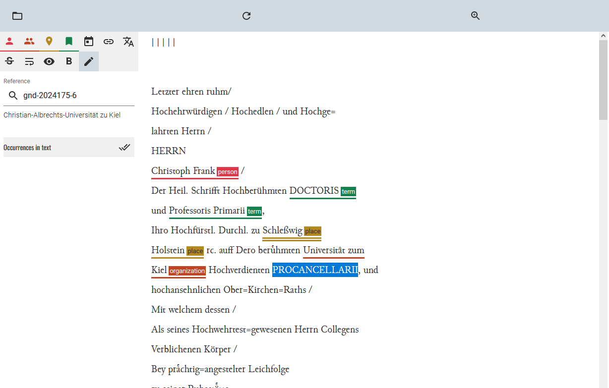
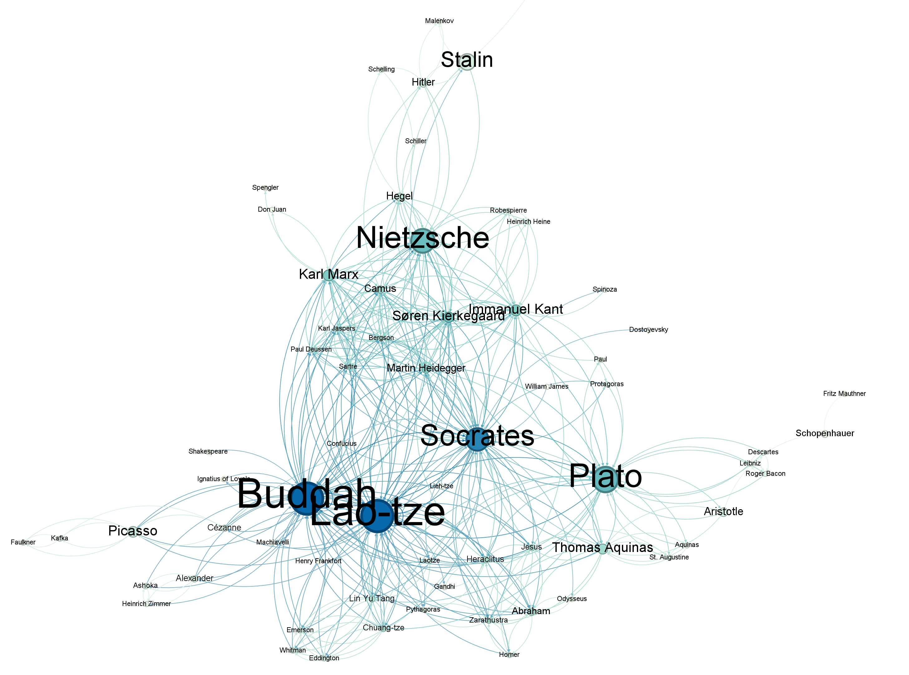

<!--

author: Moritz Riemann, Gregor Große-Bölting
email:  ggb@informatik.uni-kiel.de
version: 0.1
language: en
narrator: UK English Female
-->

# Exil und Haltung – Digital Humanities und Philosophie

**OLAT-Kurs:** https://lms.uni-kiel.de/url/RepositoryEntry/5772148992

**Dozierende:**

* Moritz Riemann (riemann@philsem.uni-kiel.de)
* Gregor Große-Bölting (ggb@informatik.uni-kiel.de)

**Zeit und Raum:** Di 16:15 - 17:45, LMS8 - R.EG.016

**Inhalte und Vorgehen:**

* Interdisziplinäres Arbeiten: Philosophie- und Informatik-studierende arbeiten zusammen und gewinnen Einblick in das andere Fach
* Einblick in die Digital Humanities und grundlegendes Verständnis digitaler Methoden geisteswissenschaftlicher Arbeit
* Arbeit mit X-Technologien, wie XML TEI, ODD, XSLT und RDF
* Praktische Fähigkeiten im Umgang mit Forschungsdaten und im kollaborativen Arbeiten
* Digitale Analyse- und Visualisierungsmethoden für geisteswissenschaftliche Fragestellungen
* Erforschung angemessener Formen interdisziplinär-digitaler Wissenschaft und Universität
* Reflexion der eigenen Fachkultur und der Methoden der Informatik bzw. Digital Humanities

## Organisatorisches

### Regierungserklärung

1. Diese Veranstaltung ist eine Forschungs**werkstatt**: Wir setzen neue Methoden und Software ein. Seid also nachsichtig mit uns und mit euch selbst, wenn mal etwas nicht funktioniert wie geplant. Lasst uns zeitnah wissen, wenn ihr Probleme habt, dann findet sich für alles eine Lösung!
2. Das Seminar wird sich voraussichtlich für Philosophiestudierende nicht wie eine Philosophieveranstaltung und für Informatikstudierende nicht wie eine Informatikveranstaltung anfühlen.
3. Ihr dürft (und sollt) gerne eigene Tools und Ideen einbringen! Der Seminarplan ist auch offen für Eure Vorschläge.
4. Interdisziplinarität lebt von wechselseitiger Verständlichkeit: Redet mit uns und mit Euren Mitstudierenden, wenn ihr Dinge nicht versteht oder Hilfe braucht.
5. Wir erwarten von euch, dass ihr euch zwischen den Sitzungen mit den Seminarinhalten befasst (Texte lest, Aufgaben erledigt) und zu den Präsenzsitzungen anwesend seid. Im Gegenzug unterstützen wir euch, wo wir können und machen Zugeständnisse, falls die Arbeitsbelastung zu groß werden sollte. 
6. Der Seminarplan ist "im Fluss".

### Semesterplan

| Datum | Thema/Inhalt | Protokoll |
|-------|--------------| --------- |
| 14.04. | Begrüßung, Einführung in das Thema, Überblick über das Semester | - | 
| 21.04. | **I. Exil und Haltung.** Was ist Haltung? Philosophische Näherung |  |
| 28.04. | Philosophie zu Beginn des 20. Jahrhunderts und Exil von Philosoph:innen: geschichtlicher Hintergrund |  |
| 05.05. | Haltung am Beispiel: Paul Ludwig Landsberg |  |
| 12.05. | Vertiefung, Referate |   |
| 19.05. | **II. Digital Humanities.** Was sind und was machen die Digital Humanities? |  |
| 26.05. | Beispiel I: Heinrich Blüchers Vorlesungen im Exil / statistische Auswertung von Texten |   |
| 02.06. | Beispiel II: Das Briefnetzwerk von Lotte Labowsky, Gertrud Bing und Raymond Klibansky / automatische Texttranskription und TEI XML |   |
| 09.06. | Beispiel III: Ein Verzeichnis geflohener Philosophinnen / RDF und *knowledge graphs* |  |
| 16.06. | **III. Praxisteil / Projektphase.** Recherche(methoden) und mögliche Quellen |   |
| 23.06. | Methode: Philosophische Podcasts und das Schreiben eines Skripts |   |
| 30.06. | Arbeitssitzung |   |
| 07.07. | Vertiefung, tba | - |

### Forschungs(daten)zyklus

#### ScanTent

#### Transkribus

#### TEI XML: Datenannotation

#### Analyse: Netzwerke, Zeitverläufe, GIS

### Prüfungsleistung

**Für Informatiker_innen:**

* "Sitzungsprotokoll" (10%)
* Skript und Podcast (je 30%)
* Peer Review (10%)
* schriftl. Reflexion (20%)

Alle Teilleistungen müssen für eine erfolgreiche Gesamtteilnahme eingereicht und bestanden werden. 

**Für Philosoph_innen:**

Jede der Prüfungsformen beinhaltet die gemeinsame Präsentation in einer Kleingruppe am Ende des Semesters.

* Referate: bitte frühzeitig melden!
* Podcast (nur für BA7 und BA8)
* Essay
* Hausarbeit

---

Mögliche Referats- und Podcastthemen:

* Sozialgeschichte der Philosophie
* Warburg-Kreis
* Cassirer 
* Porträt: Labowsky, Bing, Klibansky / Verhältnis von Philosophie und Philologie 
* ... sprecht uns an!

#### Hinweise zum "Sitzungsprotokoll" (für Informatiker_innen)

**Aufgabenstellung:** Sprecht mit Gregor eine Sitzung ab, für die ihr ein "Sitzungsprotokoll" anfertigt. Das Protokoll soll die wichtigsten Ergebnisse und Erkenntnisse der Sitzung festhalten (nicht den Verlauf) und dient als Ergänzung bzw. Erweiterung des Kursmaterials, sprich: Die "Protokolle" werden direkt in das Material übernommen und dienen als gemeinsame Ressource für alle zur Nachbereitung des Seminars. Entsprechend sollte das Protokoll so aufbereitet sein, dass ein Nicht-Anwesender Studierender sich anhand der Notizen im Nachhinein ein klares Bild davon machen kann, welche Inhalte in der entsprechenden Woche besprochen wurden. 

Das Protokoll muss bis **spätestens zwei Wochen** nach der Sitzung per E-Mail (ggb@informatik.uni-kiel.de) oder [pull request]() bei mir eingereicht werden.

Weitere Formalia:

* min. 500 Wörter (etwa eine DIN A4-Seite)
* Das Dokument ist in Markdown abgefasst (noch besser: es verwendet die [LiaScript-Syntax](https://liascript.github.io/course/?https://raw.githubusercontent.com/liaScript/docs/master/README.md#1))
* Falls externe Quellen oder Literatur verwendet wurden, müssen diese gemäß eines üblichen Zitationsstandards (APA, IEEE, ACM, etc.) angegeben werden (bevorzugt: APA)
* Falls ChatGPT o. ä. verwendet wurden: Umfang und Prompts angeben 

Für eine ausreichende (oder bessere) Arbeit

* Besitzt der eingereichte Text eine klare Struktur, die durch Markdown kenntlich gemacht wird
* Wurde eine Rechtschreib- und Grammatikprüfung durchgeführt
* Werden die wichtigsten Themen, Begriffe, etc. der Woche aufgeführt

Eine gute (oder bessere) Arbeit

* Ist verständlich geschrieben und besitzt einen deutlichen, roten Faden
* Bezieht die fachliche Expertise Mitstudierender aus der Philosophie mit ein 
* Nennt und verarbeitet Quellen, die über die Seminarliteratur hinausgehen
* Integriert sich nahtlos in das existierende LiaScript-Material für die Sitzung

Das LiaScript-Material findet ihr in diesem GitHub-Repository: tba

Um das Material zu erweitern, könnt ihr das Repo forken und eine Pull Request stellen.

#### Hinweise zur Peer Review (für Informatiker_innen)

**Aufgabenstellung:** tba

Das Protokoll ist **bis spätestens zum tba** per E-Mail (ggb@informatik.uni-kiel.de) bei mir als PDF einzureichen.

Weitere Formalia:

* 300 Wörter (+/- 20%), etwas weniger als eine DIN A4-Seite. Bitte gebt die Anzahl der Wörter am Ende des Dokuments an.
* Name, stu-Mailadresse
* Unterschriebene Eigenständigkeitserklärung
* Falls externe Quellen oder Literatur verwendet wurden, müssen diese gemäß eines üblichen Zitationsstandards (APA, IEEE, ACM, etc.) angegeben werden
* Falls ChatGPT o. ä. verwendet wurden: Umfang und Prompts angeben (ich rate von der Verwendung ab, da es sich um eine Reflexion der eigenen Erfahrungen mit dem Tool handeln soll)

Für eine ausreichende (oder bessere) Arbeit

* Besitzt der eingereichte Text eine klare Struktur
* Wurde eine Rechtschreib- und Grammatikprüfung durchgeführt
* Der Text wertschätzend und konstruktiv verfasst
* Ein "problematischer" Aspekt identifiziert

Eine gute (oder bessere) Arbeit

* Ist verständlich geschrieben und besitzt einen deutlichen, roten Faden
* Mehrere verbesserungswürdige Aspekte identifiziert
* Lösungsmöglichkeiten für die Aspekte benannt

#### Hinweise zum Skript / Podcast (für Informtiker_innen)

**Aufgabenstellung:** tba

#### Hinweise zur Reflexion (für Informatiker_innen)

**Aufgabenstellung:** tba

Die Ausarbeitung muss bis zum **30. September 2026** (Ende des Semesters) per E-Mail (ggb@informatik.uni-kiel.de) bei mir als PDF eingereicht werden.

Weitere Formalia:

* 1.000 Wörter im einspaltigen [ACM-Template](https://www.acm.org/publications/proceedings-template), bevorzugt in LaTeX ([Overleaf](https://www.rz.uni-kiel.de/de/angebote/software/overleaf/overleaf))
* Name, stu-Mailadresse
* Unterschriebene Eigenständigkeitserklärung
* Externe Quellen sind gemäß der ACM-Zitierweise anzugeben; das Literaturverzeichnis zählt nicht zur Gesamtlänge
* Falls ChatGPT o. ä. verwendet wurden: Umfang und Prompts angeben (zählt nicht zur Gesamtlänge)
* Die Arbeit kann auf Deutsch oder Englisch verfasst werden

Für eine ausreichende (oder bessere) Arbeit

* tba

Eine gute (oder bessere) Arbeit

* tba

### Hinweise zu Podcasts 

Umfangreiche Hinweise zur Erstellung von Podcasts als Prüfungsleistung findet ihr im [folgenden Leitfaden](https://liascript.github.io/course/?https://raw.githubusercontent.com/mauriemann/Podcast/main/Podcast_main.md).

## Sitzung am 14.04. 

### "Speed Dating"

Sprecht mit der Person, die euch gegenübersitzt, zwei Minuten über die folgenden Fragen:

1. Warum studiert Ihr Eure Disziplin?
2. Was bewundert Ihr an der jeweils anderen Disziplin?
3. Welche einflussreichen Frauen (Philosophinnen, Informatikerinnen) kennt ihr in eurer Disziplin?

Wenn das Signal gegeben wird, rücken diejenigen, die mit dem Rücken zum Eingang/Front sitzen, einen Platz nach links.

Diejenigen die außen sitzen wechseln die Reihe und füllen den leeren Platz in der nächsten Reihe auf usw.

### Wie liest man philosophische Texte?

Philosophische Texte sollten bzw. können nicht wie andere Texte gelesen werden: Sie müssen eingeordnet und verstanden werden, das Textverständnis erfordert eine aktive Auseinandersetzung. Rosenberg (1984) macht sechs verschiedene Vorschläge, wie man eine:n Philosoph:in lesen kann:

>1. Sie können einen Philosophen auf seine Resultate hin lesen 
>2. Sie können einen Philosophen auf seine Argumente hin lesen 
>3. Sie können einen Philosophen in seinem dialektischen Zusammenhang lesen 
>4. Sie können einen Philosophen kritisch lesen
>5. Sie können einen Philosophen auf die Entscheidung eines Problems hin lesen
>6. Sie können einen Philosophen kreativ lesen 
>
> (Rosenberg, 1984)

Der vollständige Text mit einer Erläuterung, was es mit den einzelnen Thesen auf sich hat, findet sich im [OLAT-Materialverzeichnis](). 

### Zur nächsten Sitzung

Lest zur folgenden Sitzung (im OLAT Materialverzeichnis zu finden):

* tbd

Lest den Text aufmerksam auf folgende Fragen hin:

1. tbd
