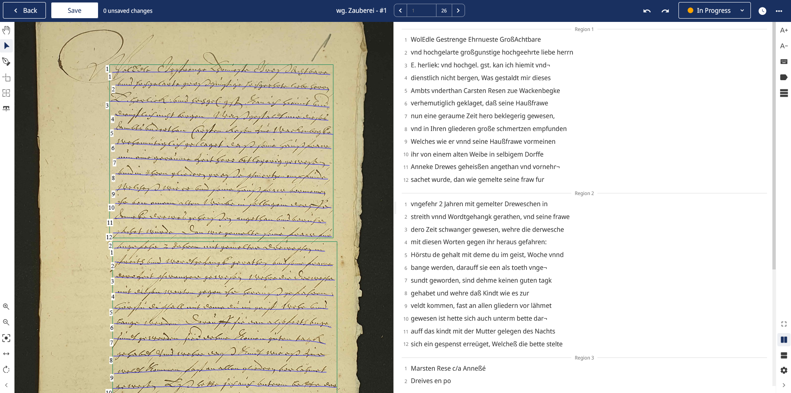
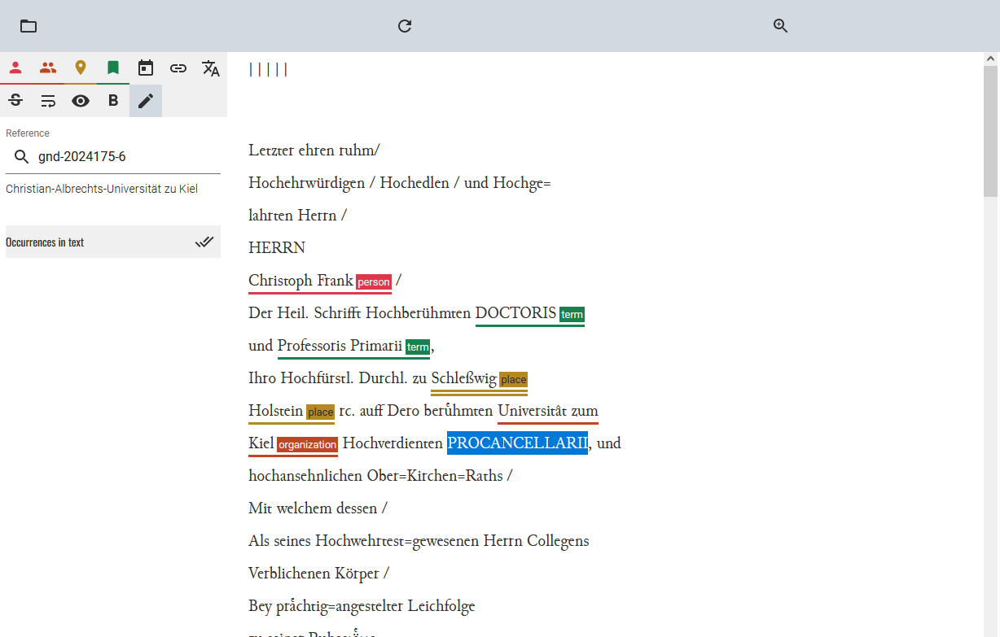
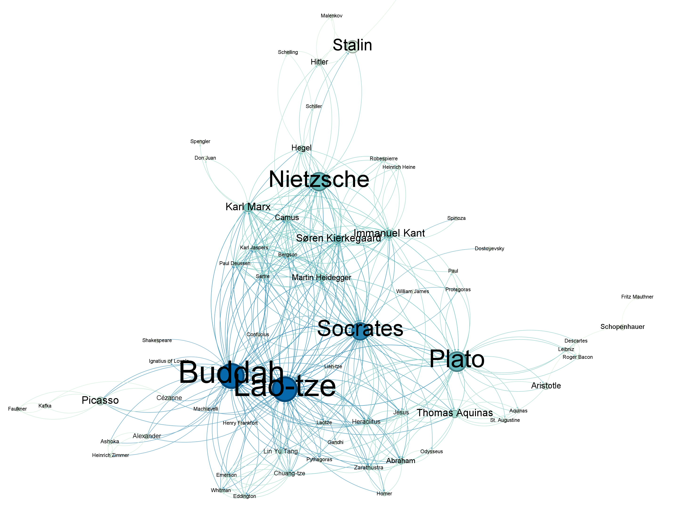
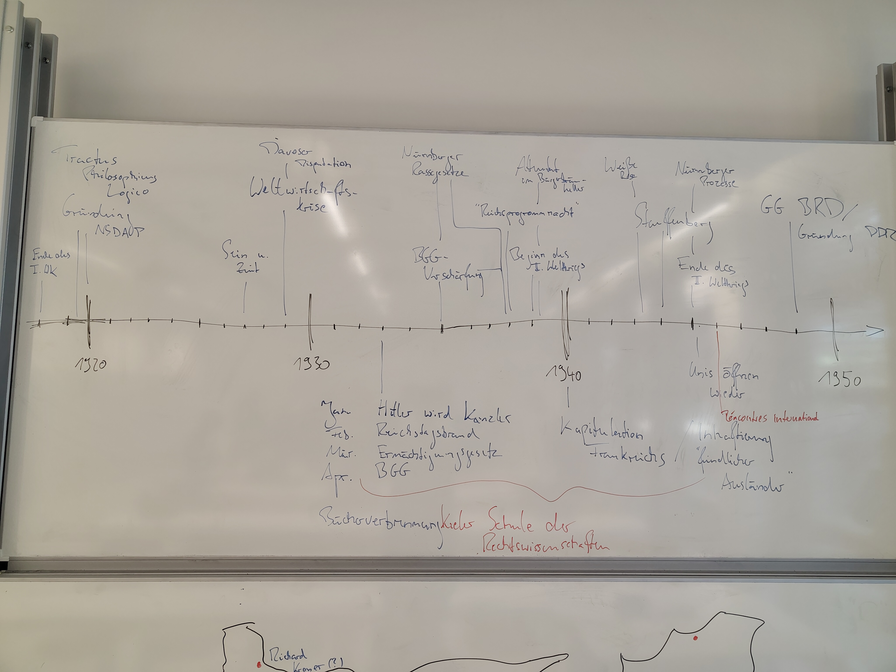
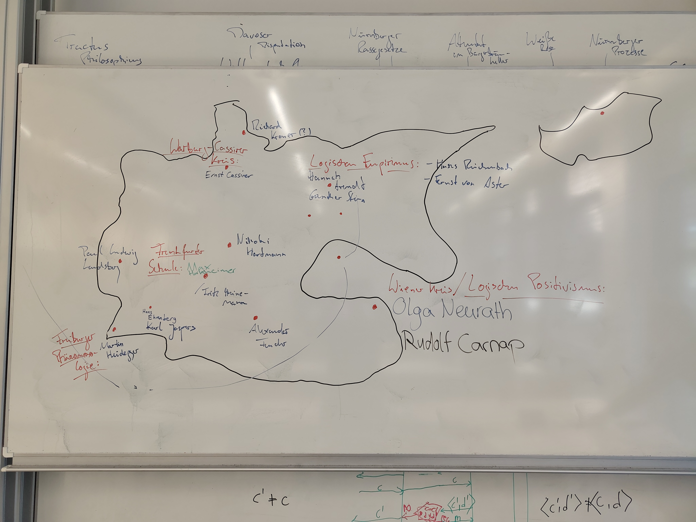
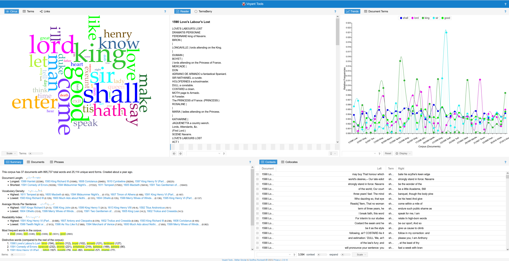
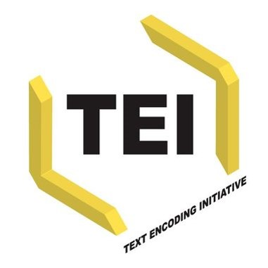
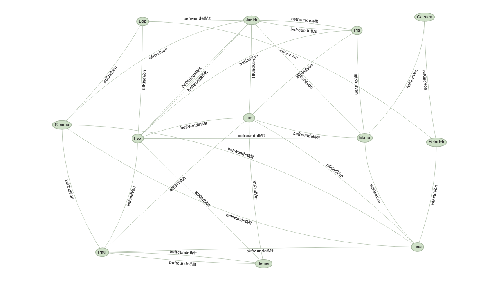

<!--

author: Moritz Riemann, Gregor Große-Bölting
email:  ggb@informatik.uni-kiel.de
version: 0.1
language: en
narrator: UK English Female
-->

# Exil und Haltung – Digital Humanities und Philosophie

**OLAT-Kurs:** https://lms.uni-kiel.de/url/RepositoryEntry/5772148992

**Dozierende:**

* Moritz Riemann (riemann@philsem.uni-kiel.de)
* Gregor Große-Bölting (ggb@informatik.uni-kiel.de)

**Zeit und Raum:** Di 16:15 - 17:45, LMS8 - R.EG.016


**Inhalte und Vorgehen:**

* Interdisziplinäres Arbeiten: Philosophie- und Informatik-studierende arbeiten zusammen und gewinnen Einblick in das andere Fach
* Einblick in die Digital Humanities und grundlegendes Verständnis digitaler Methoden geisteswissenschaftlicher Arbeit
* Arbeit mit X-Technologien, wie XML TEI, ODD, XSLT und RDF
* Praktische Fähigkeiten im Umgang mit Forschungsdaten und im kollaborativen Arbeiten
* Digitale Analyse- und Visualisierungsmethoden für geisteswissenschaftliche Fragestellungen
* Erforschung angemessener Formen interdisziplinär-digitaler Wissenschaft und Universität
* Reflexion der eigenen Fachkultur und der Methoden der Informatik bzw. Digital Humanities

## Organisatorisches

### Leitbild Lehren und Lernen der CAU

[https://www.uni-kiel.de/fileadmin/user_upload/universitaet/profil/cau-leitbild-lehren-und-lehren.pdf](Link auf das Leitbild Lehren und Lernen der CAU)


### Regierungserklärung

1. Diese Veranstaltung ist eine Forschungs**werkstatt**: Wir setzen neue Methoden und Software ein. Seid also nachsichtig mit uns und mit euch selbst, wenn mal etwas nicht funktioniert wie geplant. Lasst uns zeitnah wissen, wenn ihr Probleme habt, dann findet sich für alles eine Lösung!
2. Das Seminar wird sich voraussichtlich für Philosophiestudierende nicht wie eine Philosophieveranstaltung und für Informatikstudierende nicht wie eine Informatikveranstaltung anfühlen.
3. Ihr dürft (und sollt) gerne eigene Tools und Ideen einbringen! Der Seminarplan ist auch offen für Eure Vorschläge.
4. Interdisziplinarität lebt von wechselseitiger Verständlichkeit: Redet mit uns und mit Euren Mitstudierenden, wenn ihr Dinge nicht versteht oder Hilfe braucht.
5. Wir erwarten von euch, dass ihr euch zwischen den Sitzungen mit den Seminarinhalten befasst (Texte lest, Aufgaben erledigt) und zu den Präsenzsitzungen anwesend seid. Im Gegenzug unterstützen wir euch, wo wir können und machen Zugeständnisse, falls die Arbeitsbelastung zu groß werden sollte. 
6. Der Seminarplan ist "im Fluss".

### Semesterplan

| Datum | Thema/Inhalt | Protokoll |
|-------|--------------| --------- |
| 14.04. | Begrüßung, Einführung in das Thema, Überblick über das Semester | - | 
| 21.04. | **I. Exil und Haltung.** Was ist Haltung? Philosophische Annäherung | Momme |
| 28.04. | Philosophie zu Beginn des 20. Jahrhunderts und Exil von Philosoph:innen: geschichtlicher Hintergrund | Tom |
| 05.05. | Haltung am Beispiel: Paul Ludwig Landsberg | Jonas |
| 12.05. | Vertiefung, Referate | Jakob |
| 19.05. | **II. Digital Humanities.** Beispiel I: Heinrich Blüchers Vorlesungen im Exil / statistische Auswertung von Texten | Valeriia |
| 26.05. | Beispiel II: Das Briefnetzwerk von Lotte Labowsky, Gertrud Bing und Raymond Klibansky / automatische Texttranskription und TEI XML | Jeremy |
| 02.06. | Was sind und was machen die Digital Humanities? | Jan-Lucas |
| 09.06. | Methode: Philosophische Podcasts und das Schreiben eines Skripts | Elina |
| 16.06. | **III. Praxisteil / Projektphase.** Beispiel III: Ein Verzeichnis geflohener Philosophinnen / RDF und *knowledge graphs* | Julius |
| 23.06. | Recherche(methoden) und mögliche Quellen | Malte |
| 30.06. | Arbeitssitzung |   |
| 07.07. | Vertiefung, tba | - |

### Forschungs(daten)zyklus


#### ScanTent


#### Transkribus



#### TEI XML: Datenannotation



#### Analyse: Netzwerke, Zeitverläufe, GIS



### Prüfungsleistung

**Für Informatiker_innen:**

* "Sitzungsprotokoll" (10%)
* Skript und Podcast (je 30%)
* Peer Review (10%)
* schriftl. Reflexion (20%)

Alle Teilleistungen müssen für eine erfolgreiche Gesamtteilnahme eingereicht und bestanden werden. 

**Für Philosoph_innen:**

Jede der Prüfungsformen beinhaltet die gemeinsame Präsentation in einer Kleingruppe am Ende des Semesters.

* Referate: bitte frühzeitig melden!
* Podcast (nur für BA7 und BA8)
* Essay
* Hausarbeit

---

Mögliche Referats- und Podcastthemen:

* Sozialgeschichte der Philosophie
* Warburg-Kreis
* Cassirer 
* Porträt: Labowsky, Bing, Klibansky / Verhältnis von Philosophie und Philologie 
* ... sprecht uns an!


#### Hinweise zum "Sitzungsprotokoll" (für Informatiker_innen)

**Aufgabenstellung:** Sprecht mit Gregor eine Sitzung ab, für die ihr ein "Sitzungsprotokoll" anfertigt. Das Protokoll soll die wichtigsten Ergebnisse und Erkenntnisse der Sitzung festhalten (nicht den Verlauf) und dient als Ergänzung bzw. Erweiterung des Kursmaterials, sprich: Die "Protokolle" werden direkt in das Material übernommen und dienen als gemeinsame Ressource für alle zur Nachbereitung des Seminars. Entsprechend sollte das Protokoll so aufbereitet sein, dass ein Nicht-Anwesender Studierender sich anhand der Notizen im Nachhinein ein klares Bild davon machen kann, welche Inhalte in der entsprechenden Woche besprochen wurden. 

Das Protokoll muss bis **spätestens zwei Wochen** nach der Sitzung per E-Mail (ggb@informatik.uni-kiel.de) oder [pull request]() bei mir eingereicht werden.

Weitere Formalia:

* min. 500 Wörter (etwa eine DIN A4-Seite)
* Das Dokument ist in Markdown abgefasst (noch besser: es verwendet die [LiaScript-Syntax](https://liascript.github.io/course/?https://raw.githubusercontent.com/liaScript/docs/master/README.md#1))
* Falls externe Quellen oder Literatur verwendet wurden, müssen diese gemäß eines üblichen Zitationsstandards (APA, IEEE, ACM, etc.) angegeben werden (bevorzugt: APA)
* Falls ChatGPT o. ä. verwendet wurden: Umfang und Prompts angeben 

Für eine ausreichende (oder bessere) Arbeit

* Besitzt der eingereichte Text eine klare Struktur, die durch Markdown kenntlich gemacht wird
* Wurde eine Rechtschreib- und Grammatikprüfung durchgeführt
* Werden die wichtigsten Themen, Begriffe, etc. der Woche aufgeführt

Eine gute (oder bessere) Arbeit

* Ist verständlich geschrieben und besitzt einen deutlichen, roten Faden
* Bezieht die fachliche Expertise Mitstudierender aus der Philosophie mit ein 
* Nennt und verarbeitet Quellen, die über die Seminarliteratur hinausgehen
* Integriert sich nahtlos in das existierende LiaScript-Material für die Sitzung

Das LiaScript-Material findet ihr in diesem GitHub-Repository: tba

Um das Material zu erweitern, könnt ihr das Repo forken und eine Pull Request stellen.

#### Hinweise zur Peer Review (für Informatiker_innen)

**Aufgabenstellung:** tba

Das Protokoll ist **bis spätestens zum tba** per E-Mail (ggb@informatik.uni-kiel.de) bei mir als PDF einzureichen.

Weitere Formalia:

* 300 Wörter (+/- 20%), etwas weniger als eine DIN A4-Seite. Bitte gebt die Anzahl der Wörter am Ende des Dokuments an.
* Name, stu-Mailadresse
* Unterschriebene Eigenständigkeitserklärung
* Falls externe Quellen oder Literatur verwendet wurden, müssen diese gemäß eines üblichen Zitationsstandards (APA, IEEE, ACM, etc.) angegeben werden
* Falls ChatGPT o. ä. verwendet wurden: Umfang und Prompts angeben (ich rate von der Verwendung ab, da es sich um eine Reflexion der eigenen Erfahrungen mit dem Tool handeln soll)

Für eine ausreichende (oder bessere) Arbeit

* Besitzt der eingereichte Text eine klare Struktur
* Wurde eine Rechtschreib- und Grammatikprüfung durchgeführt
* Der Text wertschätzend und konstruktiv verfasst
* Ein "problematischer" Aspekt identifiziert

Eine gute (oder bessere) Arbeit

* Ist verständlich geschrieben und besitzt einen deutlichen, roten Faden
* Mehrere verbesserungswürdige Aspekte identifiziert
* Lösungsmöglichkeiten für die Aspekte benannt

#### Hinweise zum Skript / Podcast (für Informtiker_innen)

**Aufgabenstellung:** Produziert einen philosophischen Podcast von 5-10 Minuten (Einzelleistung) oder 20-30 Minuten (Kleingruppe, 3 bis 4 Personen), der folgende inhaltliche Anforderungen erfüllt:

* Der Podcast behandelt mindestens eine Philosoph:in, die in den 1930er Jahren aus Deutschland ins Exil fliehen musste.
* Er setzt sich mit den Themen Exil und Haltung auseinander; entweder am Beispiel der gewählten Person(en) oder in einer über das Porträt hinausgehenden konzeptuellen Auseinandersetzung.
* Optional: Der Podcast bezieht Methoden oder Perspektiven der Digital Humanities ein (z.B. Fragen der Überlieferung, Digitalisierung, Sichtbarmachung von Biographien).

Neben dem eingesprochenen Podcast ist ein ausgearbeitetes Skript einzureichen, das als eigenständige Textleistung bewertet wird.
Skript und Podcast müssen bis zum 30. September 2026 per E-Mail (ggb@informatik.uni-kiel.de) oder die CAU-Cloud bei mir eingereicht werden.

Ein Entwurf des Skripts ist in der Sitzung am 07.07. vorzustellen. 

Weitere Formalia:

* Das Skript ist in Prosa verfasst und so geschrieben, dass es vorgelesen werden kann (gesprochene Sprache, keine Stichpunkte)
* Verwendete Quellen und Literatur sind gemäß eines üblichen Zitationsstandards (APA, IEEE, ACM o.ä.) am Ende des Skripts angegeben
* Falls KI-Tools verwendet wurden: Umfang und Prompts angeben

Für eine ausreichende (oder bessere) Arbeit

* Der Podcast hat eine klar erkennbare Ausgangsfrage oder -these
* Die gewählte Philosoph:in wird in ihrem historischen Kontext vorgestellt
* Skript und Aufnahme sind inhaltlich konsistent

Eine gute (oder bessere) Arbeit

* Entwickelt eine eigene Perspektive auf die Themen Exil und/oder Haltung, die über die reine Darstellung hinausgeht
* Nutzt konkrete Beispiele, Zitate oder Quellen, um abstrakte Begriffe zu veranschaulichen
* Ist so gestaltet, dass sie für fachfremde Zuhörer:innen verständlich und nachvollziehbar ist

#### Hinweise zur Reflexion (für Informatiker_innen)

**Aufgabenstellung:** tba

Die Ausarbeitung muss bis zum **30. September 2026** (Ende des Semesters) per E-Mail (ggb@informatik.uni-kiel.de) bei mir als PDF eingereicht werden.

Weitere Formalia:

* 1.000 Wörter im einspaltigen [ACM-Template](https://www.acm.org/publications/proceedings-template), bevorzugt in LaTeX ([Overleaf](https://www.rz.uni-kiel.de/de/angebote/software/overleaf/overleaf))
* Name, stu-Mailadresse
* Unterschriebene Eigenständigkeitserklärung
* Externe Quellen sind gemäß der ACM-Zitierweise anzugeben; das Literaturverzeichnis zählt nicht zur Gesamtlänge
* Falls ChatGPT o. ä. verwendet wurden: Umfang und Prompts angeben (zählt nicht zur Gesamtlänge)
* Die Arbeit kann auf Deutsch oder Englisch verfasst werden

Für eine ausreichende (oder bessere) Arbeit

* tba

Eine gute (oder bessere) Arbeit

* tba

### Hinweise zu Podcasts 

Umfangreiche Hinweise zur Erstellung von Podcasts als Prüfungsleistung findet ihr im [folgenden Leitfaden](https://liascript.github.io/course/?https://raw.githubusercontent.com/mauriemann/Podcast/main/Podcast_main.md).

## Sitzung am 14.04. 

### "Speed Dating"

Sprecht mit der Person, die euch gegenübersitzt, zwei Minuten über die folgenden Fragen:

1. Warum studiert Ihr Eure Disziplin?
2. Was bewundert Ihr an der jeweils anderen Disziplin?
3. Welche einflussreichen Frauen (Philosophinnen, Informatikerinnen) kennt ihr in eurer Disziplin?

Wenn das Signal gegeben wird, rücken diejenigen, die mit dem Rücken zum Eingang/Front sitzen, einen Platz nach links.

Diejenigen die außen sitzen wechseln die Reihe und füllen den leeren Platz in der nächsten Reihe auf usw.

### Wie liest man philosophische Texte?

Philosophische Texte sollten bzw. können nicht wie andere Texte gelesen werden: Sie müssen eingeordnet und verstanden werden, das Textverständnis erfordert eine aktive Auseinandersetzung. Rosenberg (1984) macht sechs verschiedene Vorschläge, wie man eine:n Philosoph:in lesen kann:

>1. Sie können einen Philosophen auf seine Resultate hin lesen 
>2. Sie können einen Philosophen auf seine Argumente hin lesen 
>3. Sie können einen Philosophen in seinem dialektischen Zusammenhang lesen 
>4. Sie können einen Philosophen kritisch lesen
>5. Sie können einen Philosophen auf die Entscheidung eines Problems hin lesen
>6. Sie können einen Philosophen kreativ lesen 
>
> (Rosenberg, 1984)

Der vollständige Text mit einer Erläuterung, was es mit den einzelnen Thesen auf sich hat, findet sich im [OLAT-Materialverzeichnis](https://lms.uni-kiel.de/auth/RepositoryEntry/5772148992/CourseNode/113529231322421/path%3D~~Texte/0). 

### Zur nächsten Sitzung

Lest zur folgenden Sitzung (im OLAT Materialverzeichnis zu finden):

* Grimm, Keber, Zöllner: Haltung im digitalen Zeitalter. Wie wir der Welt begegnen (2019).
* Frauke Kurbacher: Interpersonalität zwischen Autonomie und Fragilität (2017).

Lest den Text aufmerksam auf folgende Fragen hin:

1. Welche Anschlusspunkte zum Leitbild Lehren und Lernen (Haltung) findet Ihr in den Texten?
2. Wo seht ihr Bezüge zwischen den Texten?
3. Was ist im ethischen Sinne eine Haltung?
4. Wie viel Mut kostet es eine Haltung zu vertreten? Was können Widerstände sein? 
5. Wie kann man Haltung praktisch umsetzen?

## Sitzungsprotokoll am 21.04. 

### Erster Eindruck der Texte

Der Text aus Digitale Ethik von Grimm, Keber und Zöllner wurde in der Gruppe ganz gut aufgenommen. Er liest sich wie ein "normaler" Sachtext und hat viele Beispiele aus der digitalen Welt. Der Kurbacher-Text wirkte dagegen erstmal überfordernd und vage. Es war für viele schwer, eine klare Kernaussage aus dem Text abzuleiten.

Anschließend hatten wir eine kurze Diskussion über den Begriff Interpersonalität, der bei Kurbacher zentral ist. Für den Moment haben wir ihn als den Austausch zwischen Personen verstanden, also das "Dazwischen", in dem man sich auf andere bezieht und umgekehrt.

#### Ergebnis der Leitfragen aus Kleingruppen und Plenum

##### Frage 1: Anschlusspunkte zum Leitbild Lehren und Lernen

Beide Texte legen nahe, dass Bildung mehr ist als reine Wissensvermittlung. Es geht auch um
Persönlichkeitsbildung, Urteilsfähigkeit und Verantwortung. In der Praxis ist das aber nicht so leicht
umzusetzen: Vorlesungen mit 300 Studierenden lassen wenig Raum für so etwas wie echte
Haltungsbildung, direkten Austausch und die Uni hat natürlich nur begrenzte Mittel (Dozierende,
Übungen, Räume etc.) und will die möglichst optimal nutzen.
Kritisch haben wir dazu angemerkt, dass im Leitbild der CAU zwar eine bestimmte Haltung
eingenommen wird, aber kaum Begründungen und Raum für Diskurs dafür gegeben werden.

##### Frage 2: Bezüge zwischen den Texten

Beide Texte nehmen die Selbstreflexion stark in den Fokus und betonen, dass Haltung sich immer auf
etwas beziehen muss. Im ersten Text (Zöllner) geht es dabei eher um den Bezug zu aktuellen
Geschehnissen in der digitalen Welt. Beide zielen im Grunde aber darauf, Haltung als einen
relationalen Begriff zu verstehen, also als etwas, das man in interpersoneller Bezüglichkeit auslebt.

##### Exkurs: Gesinnung vs. Haltung

Während Frage 2 sind wir ein Stück weit abgeschweift zu der Frage, was eigentlich der Unterschied
zwischen Gesinnung und Haltung ist. Wir sind zu dem Ergebnis gekommen, dass Gesinnung eher
etwas ist, dass man von anderen übernimmt (Familie, Umfeld, Gesellschaft). Währenddessen Haltung
stärker aus einem selbst kommt. Mit der Haltung wächst ein eigenes Wertekonstrukt, welches
wiederum durch interpersonellen Austausch wächst.

##### Frage 3: Was ist im ethischen Sinne eine Haltung?

Bei Zöllner ist der zentrale Gedanke, dass Haltung sich im Handeln zeigt, nicht nur im Reden und sie
beinhaltet den Einsatz für ein respektvolles Miteinander. Ein Kommilitone aus der Philosophie hielt
fest: „Ethik ist die Theorie, Haltung ist die Praxis, die die Theorie mit eigenen Erfahrungen und
Erlebnissen kombiniert.“

Bei Kurbacher ist die zentrale Figur das Wechselspiel zwischen Autonomie und Fragilität. Daran hängt
die Frage: Was wird aus meiner Haltung, wenn ich in Umstände gerate, die diese schwächen? Zum
Beispiel bei Krankheit oder wenn ich aus meinen sozialen Bezügen herausgenommen werde. Genau
hier haben wir den Bogen zum Seminarthema Exil geschlagen: Wenn ich meinen gewohnten Raum
verlasse, bin ich erstmal fragil, weil viel neu ist.

„Darin verstehe ich Haltung sehr grundsätzlich als Bezüglichkeit, die fragile wie autonome Aspekte
unserer menschlichen Existenz in ihrer Problematik wie Potentialität umgreift" (Kurbacher, 2016,
S.145). Eine richtig knappe und präzise Definition liefert Kurbacher selbst nicht und begründet dies
auch (vgl. Kurbacher, 2016, S.11).

##### Frage 4: Wie viel Mut kostet eine Haltung? Widerstände?

Als erstes haben wir konkrete Beispiele gesammelt. Ein naheliegendes war KI: Wenn ich auf KI-Tools
angewiesen bin, weil ich sonst im Studium, oder aber im Job den Anschluss verliere nutze ich sie
dann, obwohl ich es eigentlich nicht möchte, oder bleibe ich standhaft?

Gregor hat dazu zwei reale Fälle eingebracht: einmal Google und das US-Verteidigungsministerium,
wo Google-Mitarbeiter gegen die Kooperation gestreikt haben, und einen aktuellen Fall mit Anthropic
und einem US-Ministerium. Außerdem haben wir auf den Mut zum Widerstand gegen das NS-Regime
hingewiesen, der natürlich eine ganz andere Größenordnung hatte. Dies wird in den kommenden
Sitzungen aber noch weiter thematisiert.

Die Gruppe ist zu dem Schluss gekommen, dass Haltung zu zeigen sowohl viel als auch wenig Mut
kosten kann. Nach Kurbacher ist eigentlich jede interpersonelle Handlung schon Teil einer Haltung.
Insofern leben wir Haltung im Alltag ständig aus, oft ohne groß darüber nachzudenken. Schwierig
wird es dann, wenn Angst, Abhängigkeit, Bequemlichkeit oder einfach die schiere Komplexität der
(digitalen) Welt dazukommen. Gerade im Digitalen ist es oft kaum durchschaubar, was die eigenen
Handlungen bewirken und genau das hemmt oder hindert uns, Haltung zu zeigen (vgl. Zöllner, 2019,
S.219).

##### Frage 5: Wie kann man Haltung praktisch umsetzen?

Zu Frage 5 sind wir nicht gekommen. Diese wird nächste Woche noch einmal besprochen.
Kurzes Fazit

Der für mich wichtigste Punkt der Sitzung: Haltung ist nichts, was man einmal hat und dann für
immer ist. Beide Texte zeigen aus verschiedenen Richtungen, dass Haltung sich im Tun zeigt und auf
Beziehungen angewiesen ist. Genau deshalb ist sie im Kontext Exil so interessant. Wer seinen
gewohnten Rahmen verliert, verliert erstmal auch das, was seine Haltung bisher getragen hat, und
muss sie dann neu finden oder neu verteidigen.

### Literatur

* Grimm, P., Keber, T. O., & Zöllner, O. (2019). Digitale Ethik. Leben in vernetzten Welten. Reclam.
* Kurbacher, F. A. (2016). Interpersonalität zwischen Autonomie und Fragilität. Grundzüge einer Philosophie der Haltung. In F. A. Kurbacher & P. Wüschner (Hrsg.), Was ist Haltung? Begriffsbestimmung, Positionen, Anschlüsse (S. 145–162). Königshausen & Neumann.

### Zur nächsten Sitzung

Recherchiert: Welche philosophischen Strömungen und Schulen gab es im deutschsprachigen Raum zu Beginn des 20. Jahrhunderts. Welche Philosophen waren im gleichen Zeitraum tätig, wer musste Deutschland aufgrund des Nationalsozialismus verlassen? Wer ist zurückgekehrt?

Bitte lest außerdem:

* Hans Jörg Sandkühler: Vergessen? Verdrängt? Erinnert? Philosophie im Nationalsozialismus. In. Ders.: Philosophie im Nationalsozialismus (Einleitung aus dem im OLAT hinterlegten Buch)
* (Optional) Lars Lambrecht: Vom ›Geist unbefangener Menschlichkeit‹ Hannah Arendt und Karl Jaspers als Beispiele kritischer Haltung in der Zeit des Nationalsozialismus. In: Hans Jörg Sandkühler: Philosophie im Nationalsozialismus.


## Sitzungsprotokoll am 28.04.

### Vorbereitung und Leitfragen

Zur Vorbereitung auf diese Sitzung war zu recherchieren, welche philosophischen Strömungen und Schulen im deutschsprachigen Raum zu Beginn des 20. Jahrhunderts tätig waren. Außerdem war zu recherchieren, wer Deutschland aufgrund des Nationalsozialismus verlassen musste und wer anschließend zurückkehrte. Zudem war die Einleitung von Hans Jörg Sandkühler "Vergessen? Verdrängt? Erinnert?" zu lesen.

### 1. Historischer Rahmen



Zur Verortung wurde gemeinsam eine Zeitleiste der für die Fragestellung zentralen Daten erarbeitet:

- **1918** Ende des Ersten Weltkriegs
- **1920** Gründung der NSDAP
- **1921** Wittgenstein, *Tractatus logico-philosophicus*
- **1927** Heidegger, *Sein und Zeit*
- **1929** Weltwirtschaftskrise; **Davoser Disputation** zwischen Ernst Cassirer und Martin Heidegger
- **1933** Hitler wird Reichskanzler; Reichstagsbrand und Reichstagsbrandverordnung (27./28.02.); Ermächtigungsgesetz; **Gesetz zur Wiederherstellung des Berufsbeamtentums (BBG)** im April; Bücherverbrennungen
- **1935** Nürnberger Rassengesetze
- **1938** Reichspogromnacht
- **1939** Beginn des Zweiten Weltkriegs; Georg-Elser-Attentat; mit Kriegsbeginn werden jüdische Geflüchtete nicht mehr nur als „jüdische Ausländer", sondern auch als „feindliche Ausländer" eingestuft → Inhaftierung in den Aufnahmeländern
- **1940** Kapitulation Frankreichs
- **1944** Stauffenberg-Attentat
- **1945** Kriegsende; Nürnberger Prozesse; ab Wintersemester 1945/46 öffnen die Universitäten wieder
- **1946** *Rencontres internationales de Genève*
- **1949** Grundgesetz und Gründung der DDR

**Stellung von Frauen in der Wissenschaft:** Im Kaiserreich waren die Universitäten zwar stark finanziert, Frauen jedoch faktisch von der Lehre ausgeschlossen; die Weimarer Republik finanzierte die Hochschulen schwächer, eröffnete Frauen aber erstmals den Zugang zur akademischen Lehre.

### 2. Strömungen, Schulen und Akteure



Im Plenum wurden zentrale philosophische Schulen und ihre Vertreter ihren Wirkungsorten zugeordnet:

- **Frankfurter Schule** (Frankfurt a. M.): Max Horkheimer, Theodor W. Adorno – ihre marxistisch geprägte Theoriebildung machte sie aus Sicht des Regimes zu einem besonderen Feindbild.
- **Wiener Kreis – logischer Positivismus** (Wien): Otto Neurath, Rudolf Carnap.
- **Logischer Empirismus** (Berlin): Hans Reichenbach, Günther Stern.
- **Warburg-Kreis** (Hamburg): Ernst Cassirer.
- **Kiel:** Richard Kroner wurde 1934 als Professor entfernt.
- **Göttingen:** Nicolai Hartmann.
- **Heidelberg:** Karl Jaspers, Hans Ehrenberg.
- **Bonn:** Paul Ludwig Landsberg.
- **München:** Alexander Pfänder.
- **Freiburg:** Martin Heidegger – NSDAP-Mitglied und einer der ersten prominenten Philosophen, die das Regime öffentlich unterstützten.
- **Berlin:** Hannah Arendt.
- **Gießen:** Ernst von Aster.

### 3. Exil

Mit dem BBG (April 1933) begann die systematische Entfernung jüdischer und politisch missliebiger Hochschullehrer aus den Universitäten. Beliebte erste Exilländer waren **Belgien, die Niederlande und die Schweiz**. Mit Kriegsbeginn 1939 verschärfte sich die Lage. Die Umkategorisierung jüdischer Geflüchteter zu „feindlichen Ausländern" führte in den Aufnahmeländern zu Inhaftierungen, die viele zur weiteren Flucht zwangen.

### 4. Rückkehr

Eine Liste aller Rückkehrer wurde nicht erstellt. Allerdings haben wir zwei zentrale Punkte festgehalten. Die **Wiederöffnung der Universitäten ab dem Wintersemester 1945/46** und die **Rencontres internationales de Genève (1946)** markieren den Wiederbeginn des intellektuellen Austauschs nach dem Krieg. Die Wiederöffnung der Universitäten ab dem Wintersemester 1945/46 vollzog sich unter den Bedingungen der alliierten Entnazifizierungspolitik. Viele Lehrstühle waren durch Entlassungen und Kriegseinwirkungen unterbesetzt. Sie mussten neu besetzt werden, teils durch Personen, die bereits unter dem Regime gelehrt hatten und nun politisch überprüft wurden. Teilweise aber auch durch zurückgekehrte Personen.

### 5. Eindrücke vom Text

Aus der Lektüre der Sandkühler-Einleitung wurden in der Diskussion drei Punkte besonders hervorgehoben:

- **Karl Mannheim:** Die im Text herangezogenen Aussagen Mannheims blieben für uns deutungsoffen und wurden als zu klärende Stelle für die weitere Auseinandersetzung notiert.

- **Der Fall Landsberg:** Paul Ludwig Landsberg musste fliehen, wurde aber zugleich vom Regime positiv erwähnt. Dieses Beispiel macht deutlich, dass Verfolgung und ideologische Vereinnahmung nicht gegeneinander stehen müssen.

- **Vorsicht bei Universitätsaussagen unter Diktaturen:** Sandkühlers Mahnung, dass Aussagen aus Universitäten unter einer Diktatur kritisch zu lesen sind, weil Diktaturen die Seele verändern, wurde als zentrale methodologische Leitlinie festgehalten. Im Nachhinein lässt sich nur schwer feststellen, wer wirklich ideologisch überzeugt war und wer sich aus Anpassung entsprechend äußerte.


### Zur nächsten Sitzung

Bitte bereitet für die Sitzung am 05.05. aus Landsbergs "Einführung in die Anthropologie" (1934) die Seiten 9 bis 30, für den 12.05. die Seiten 74 bis 96 vor (beide Abschnitte findet ihr im gleichen Dokument). Zudem dient der Text Geist im Exil von Eduard Zwierlein (2009) als Hintergrund für beide Sitzungen; er ist länger, aber deutlich einfacher zu lesen und geht auf die Biographie von Paul Ludwig Landsberg und seinen Weg in und durch das Exil ein. 

## Sitzungsprotokoll 05.05.

### Wer war Paul Ludwig Landsberg?

Paul Ludwig Landsberg war einer von vielen deutschen Philosophen mit jüdischer Herkunft, die zur Zeit des Nationalsozialismus aus Deutschland fliehen mussten (ULB, 2024). Landsberg, der in einem gebildeten Elternhaus aufwuchs, begeisterte sich bereits in jungem Alter für die Philosophie, insbesondere für den marxistischen Sozialismus und vertrat seine Haltung ebenfalls nach außen. Ein wichtiger Mentor war sein philosophischer Lehrer Max Scheler, der ihn während seiner Karriere oft zur Seite stand. Nach der Schule studierte er zuerst 1920/21 in Freiburg, wo er unter anderem Martin Heidegger kennenlernte. Paradoxerweise war Landsberg zur Lebenszeit mit mehreren deutschen Philosophen, z.B. Heidegger und Erich Rothacker in Kontakt gestoßen, die später während des Nationalsozialismus das Regime aktiv unterstützten, zu ihm allerdings noch nach dem Ende des Zweiten Weltkrieg engen Kontakt pflegten (Peter, 2018; ULB, 2025). Nach einem weiteren Universitätsaufenthalt von 1921 bis 1923 in Köln ging Landsberg nach Berlin. Der Tod seines Vaters 1927 und der Tod Max Schelers 1928 trafen Landsberg schwer. Diese Ereignisse könnten Landsberg unter anderem später zu seiner philosophischen Anthropologie inspiriert haben, um der Bestimmung des Menschen näher zu kommen. 1928 habilitierte er an der Universität Bonn und lehrte dort ab 1929 als Privatdozent. 1932 war sein Entwurf "Einführung in die philosophische Anthropologie" fertig, dessen Veröffentlichung 1934 erst zu seiner Exilzeit stattfand. Denn nachdem er die NSDAP kritisierte und aufgrund dessen unter Beobachtung stand, entschied er sich 1933 frühzeitig in die Schweiz und danach nach Frankreich zu fliehen. 1934 migrierte er stets mit seiner Frau weiter nach Spanien, um dort erneut als Professor in Barcelona zu lehren. Um den sich anbahnenden Bürgerkrieg in Spanien zu umgehen, begab sich Landsberg 1936 nach Paris. Nach der Besetzung Frankreichs durch die Nationalsozialisten wurde Landsberg 1943 von der Gestapo festgenommen und in das KZ Oranienburg-Sachsenhausen verschleppt, wo er bis zu seinem Tod 1944 verblieb. Zu seiner Zeit auf der Flucht blieb Landsberg trotz schwerer Schicksalsschläge stets optimistisch und aufrecht. Paul Ludwig Landsberg ist in Deutschland nach seinem Tod bis heute relativ unbekannt geblieben. (Zwierlein, 2009)

### Philosophische Anthropologie

#### Geschichte

Die philosophische Anthropologie beschäftigt sich mit der Selbstauffassung des Menschen und untersucht, was der Mensch ist und wozu er bestimmt ist (Landsberg, 1934). Mit der philosophischen Anthropologie beschäftigte sich bereits Aristoteles, der erkannte, dass der Mensch Vernunft besitzt und sich dadurch als Wesen vom Tier unterscheidet. Anfang des 20. Jahrhunderts begannen deutsche Philosophen, u.a. Landsberg, Scheler, Gehlen erneut sich mit der philosophischen Anthropologie zu beschäftigen.  

#### Philosophische Anthropologie nach Landsberg

Landsberg hält fest, dass jede (un)bewusste Beschäftigung mit dem Menschen immer aus einer spezifischen Perspektive mit einer Vorstellung geschieht. Außerdem unterscheidet er zwischen Merkmals- und Wesensanthropologie. (Landsberg, 1934)

##### Merkmalsanthropologie

Die Merkmalsanthropologie versucht besondere Merkmale aus Beobachtungen von außen zu identifizieren, die den Menschen als eigene Gattung von anderen Tiergattungen unterscheiden. Daher spricht man auch vom empirischen Gattungsbegriff. Landsberg kritisiert hierbei vor allem die Bezeichnung des Menschen als höchste Tiergattung und vergleicht die Gattungen aus unterschiedlichen Perspektiven. So müsse sich der Mensch zum Beispiel mittels Bildung Wissen selbst aneignen, da er im Vergleich zu anderen Gattungen relativ wenige Instinkte bzw. spezialisiertes Wissen besitze. (Landsberg, 1934)

##### Wesensanthropologie  

Die Wesensanthropologie fragt nach dem Wesen des Menschen und untersucht, was den Menschen im Innersten ausmacht und grundlegend bestimmt. Daher spricht man auch vom Wesensbegriff. Nach Landsberg müsse jede isolierte Frage über den Menschen auf die Wesensfrage bezogen werden, um den Menschen als Ganzes betrachtet zu untersuchen. (Landsberg, 1934)

### Literaturverzeichnis

* Landsberg, P. L. (1934). *Einführung in die philosophische Anthropologie*. Vittorio Klostermann.
* Peter, C. (2018). Martin Heideggers Rechtsdenken und der Nationalsozialismus. *ARSP: Archiv Für Rechts- Und Sozialphilosophie*, 104(2), 202–219. http://www.jstor.org/stable/45175227
* Universitäts- und Landesbibliothek Bonn. (2024, 28. Mai). *Zum 80. Todesjahr von Paul Ludwig Landsberg*. https://www.sammlungen.ulb.uni-bonn.de/de/aktuelles/zum-80-todesjahr-von-paul-ludwig-landsberg
* Universitäts- und Landesbibliothek Bonn. (2025, 10. August). *Im Fadenkreuz: Erich Rothacker (1888-1965)*. https://www.sammlungen.ulb.uni-bonn.de/de/aktuelles/im-fadenkreuz-erich-rothacker-1888-1965
* Zwierlein, E. (2009). Geist im Exil. In P. L. Landsberg (Hrsg.), *Die Erfahrung des Todes* (S. 117-159). Matthes & Seitz Berlin.

### Zur nächsten Sitzung

Bitte bereitet für die Sitzung am 05.05. aus Landsbergs "Einführung in die Anthropologie" (1934) die Seiten 9 bis 30, für den 12.05. die Seiten 74 bis 96 vor (beide Abschnitte findet ihr im gleichen Dokument). Zudem dient der Text Geist im Exil von Eduard Zwierlein (2009) als Hintergrund für beide Sitzungen; er ist länger, aber deutlich einfacher zu lesen und geht auf die Biographie von Paul Ludwig Landsberg und seinen Weg in und durch das Exil ein. 

## Sitzungsprotokoll am 12.05.

**Seminar:** *Exil und Haltung - Digital Humanities in Philosophie und Informatik (SoSe 2026, CAU Kiel)*
**Leitung:** *Dr. Gregor Große-Bölting und Moritz Riemann*
**Datum:** *Sitzung am 12.05.2026*
**Protokollant:** *Jakob*

### 1. Vorbereitung auf die Sitzung

Die Grundlage der Sitzung bildete der Text von Paul Ludwig Landsberg „Einführung in die philosophische Anthropologie" von 1934, insbesondere die Seiten 74 bis 96. Als biographischer Hintergrund diente ergänzend der Text „Geist im Exil" von Eduard Zwierlein (2009).

### 2. Relevante Fachbegriffe

Im Text von Landsberg werden verschiedene Begriffe genannt, die für das Verständnis des Textabschnitts notwendig sind. Diese sind hier aufgeführt und erläutert:
- **Determinismus:** Die Auffassung, dass die Zukunft des Menschen gesetzmäßig festgelegt ist und er sie nicht frei gestalten kann.
- **Individualismus:** Die Überzeugung, dass jeder Mensch als einzigartige Einzelperson zur Verwirklichung der Menschheitsidee beiträgt.
- **Kollektivismus:** Die Auffassung, dass der Mensch vor allem Teil eines größeren Ganzen wie Nation, Klasse oder Geschichte ist.
- **Humanismus:** Die Idee, dass der Mensch sich geschichtlich entfaltet und Freiheit, Verantwortung sowie Gemeinschaft miteinander verbindet.

### 3. Wichtige Aspekte des Textes

Ein zentrales Thema des Textabschnitts ist die begriffliche Spannung zwischen "Volk" und "Humanität", welche von einer Kommilitonin aus der Philosophie als wichtiger Aspekt identifiziert wurde. Landsberg hebt hervor, dass sich die Humanitätsbegriffe der großen Nationen komplementär zu deren Nationalideen verhalten und dadurch je spezifisch geprägt sind (Landsberg, 1934, S. 75). Besonders deutlich wird diese Spannung, wenn Landsberg feststellt, dass sich der Nationalitätsbegriff in Deutschland "wesentlich in Opposition gegen den Humanitätsbegriff formte" (Landsberg, 1934, S. 76).

Ein weiterer zentraler Aspekt ist die Gegenüberstellung des französischen Kollektivismus und des deutschen Individualismus. Nach Landsberg erfolgt die Entwicklung der Humanitätsidee in Frankreich als Folge der antireligiösen Aufklärung und der Französischen Revolution, deren "notwendige Consequenz (...) eben der Übergang zum Collectivismus" war (Landsberg, 1934, S. 75). Beim deutschen Individualismus hingegen wird die Humanitätsidee stets mit einer Vorstellung vom individuellen Fortleben verbunden. Humanität erscheint hier als individuelle Bildungsaufgabe, unlösbar verknüpft mit der Unsterblichkeit der Person. In Frankreich hingegen gilt sie als kollektiver Gattungsprozess, in dem der Einzelne im historischen Ganzen aufgehoben ist. Landsberg wertet diese Gegenüberstellung nicht einseitig, sondern zeigt, dass beide Formen in Spannung zur Religion geraten, sobald die Menschheit sich selbst an die Stelle Gottes setzt (Landsberg, 1934, S. 74).

### 4. Historische Entwicklung der Humanitätsidee

Landsberg verweist auf einen entscheidenden Wandel im späten 18. Jahrhundert: An die Stelle der Theologie tritt die Anthropologie, wobei sich die Grundlage menschlichen Handelns nicht mehr aus göttlichen Geboten ableitet, sondern aus dem „eigenen Wesen als Mensch, das Gott in ihn hineingelegt hat" (Landsberg, 1934, S. 78). Als weiteres Schlüsselereignis hebt Landsberg den Ersten Weltkrieg hervor, den er als „das erste wirkliche gemeinsame historische Erlebnis der empirischen Gesamtheit einer Menschheitsgeneration" bezeichnet (Landsberg, 1934, S. 78).

In diesem Kontext führt Landsberg den Begriff der „Autonomie" ein (Landsberg, 1934, S. 78). Durch die Verbindung des Geschichtlichen mit einer Verinnerlichung des Ethischen gelangt er zu der Auffassung, „daß das Wesen des Menschen das Werdesein einer sich entfaltenden Idee sei" (Landsberg, 1934, S. 79). Darin erblickt er einen „dauernden Gehalt der Humanitätsidee" (Landsberg, 1934, S. 79).

Besonders relevant ist in diesem Zusammenhang der Satz: „Humanitätsidee freilich und strenger Determinismus schließen sich aus" (Landsberg, 1934, S. 85). Landsberg verweist damit auf die Zukunft der Humanitätsidee und darauf, dass der Mensch tatsächlich Verantwortung für die Richtung tragen kann, die das Werden der Menschheit nimmt. „Strenger Determinismus“ hingegen besagt, dass die Zukunft bereits festgelegt ist. Daraus lässt sich schließen, dass derjenige, der den Menschen als vollständig bestimmtes Naturwesen begreift, die Grundbedingung der Humanitätsidee bereits aufgegeben hat.

### 5. Was sagt der Text über den Haltungsbegriff?

Den Begriff der Haltung verwendete Landsberg nur einmal. Er stellt fest, dass „jede Beschäftigung mit dem Menschen schon abhängig ist von einer solchen Gesamtselbstauffassung, welche die Haltung des Forschers bestimmt" (Landsberg, 1934, S. 11). Haltung wird hier als ontologische Vorentscheidung verstanden, nicht als neutrale Einstellung, sondern als immer wirksame Grundorientierung. 
Ein weiterer Satz lässt sich als impliziter Haltungsgedanke Landsbergs deuten: „daß Anlaß und Notwendigkeit zu Haß und Krieg verschwinden" (Landsberg, 1934, S. 94). Darin zeigt sich eine friedliche Zukunftsvision, die davon ausgeht, dass Hass und Krieg nicht naturgegeben oder unvermeidbar sind.

### 6. Zusammenfassung

Die Seiten 74–96 bei Landsberg behandeln zentrale Fragen der Humanitätsidee: die historische Entwicklung, die Spannung zwischen nationalem und universalem Denken sowie die Verantwortung des Menschen für die geschichtliche Entwicklung. Der Vergleich zwischen französischem Kollektivismus und deutschem Individualismus verdeutlicht, wie unterschiedlich die Humanitätsidee kulturell geprägt sein kann. Verbindungen zum Haltungsbegriff zeigen sich vor allem in Landsbergs Verständnis von Forschung als wertgebundener Praxis und in seiner friedlichen Zukunftsvision.

### 7. Literaturverzeichnis

Landsberg, P. L. (1934). *Einführung in die philosophische Anthropologie*. Vittorio Klostermann.

### Zur nächsten Sitzung

Bitte macht euch mit der folgenden Website vertraut: https://research.uni-leipzig.de/bluecherproject/

* Lest die [Editor's Note](https://research.uni-leipzig.de/bluecherproject/editors-note/)
* Lest die [erste Vorlesung](https://research.uni-leipzig.de/bluecherproject/sources-of-creative-power-1-fall-semester-lecture-1/)
* Hört den zugehörigen Podcast (Podcast 1: Overview) oder gerne auch mehr!


## Sitzung am 19.05.

Diese Sitzung thematisiert die grundsätzliche Funktionsweise von Verfahren zur automatischen Textverarbeitung und welche Abstriche dabei in Kauf genommen werden. Außerdem beschäftigen wir uns mit Voyant Tools, einer Software zur automatischen Textanalyse.

Weiterführende Literatur und Ressourcen:

* In OLAT finden sich Vorlesungen von Heinrich Blücher zum Herumprobieren.
* Für alle, die sich dem Thema programmierend nähern möchten: https://pythonhumanities.com/textbooks/ bzw. https://pythonhumanities.com/course/
* Weitere Texte für eigene Versuche finden sich bspw. im [Deutschen Textarchiv](https://www.deutschestextarchiv.de), z. B. Immanuel Kants ["Beantwortung der Frage: Was ist Aufklärung?"](https://www.deutschestextarchiv.de/book/show/16167)


### Grundlagen der automatischen Textverarbeitung

Texte werden im Computer als eine Zeichenkette oder eine Folge von Zeichen (*string*) repräsentiert. Dieser Ansatz ermöglicht es, Texte in digitaler Form zu speichern, zu verarbeiten und anzuzeigen. Jeder Buchstabe, Satzzeichen, Zahl oder Sonderzeichen, die in einem Text vorkommen, wird dabei durch eine spezielle Codierung abgebildet.

Eine der häufigsten Codierungen für die Repräsentation von Texten ist die ASCII-Codierung (American Standard Code for Information Interchange). Hierbei werden Buchstaben, Zahlen, Sonderzeichen und Steuerzeichen durch jeweils 7 oder 8 Bits dargestellt. Das bedeutet, dass jedem Zeichen eine eindeutige Binärsequenz zugeordnet wird, was es dem Computer ermöglicht, die Zeichen korrekt zu interpretieren und anzuzeigen.

")

**Beispiel:** Der String *Hallo* würde in ASCII als `01001000 01100001 01101100 01101100 01101111 00100001` repräsentiert werden. 

Mit der Zeit wurden weitere (und komplexere) Codierungsstandards entwickelt, um Zeichen aus verschiedenen Sprachen und Schriften darstellen zu können. Zum Beispiel ermöglicht Unicode die Darstellung einer Vielzahl von Schriftsystemen, darunter auch komplexere Schriften wie chinesische, arabische und indische Schriften. Unicode erweitert die ASCII-Codierung und weist jedem Zeichen eine eindeutige Nummer zu, wodurch es möglich wird, Texte in verschiedenen Sprachen und Schriftsystemen auf Computern korrekt wiederzugeben.

**Beispiel:** Angenommen, wir haben den Text "こんにちは" in der japanischen Sprache, was "Konnichiwa" auf Englisch bedeutet. Jedes Zeichen in diesem Text wird gemäß der Unicode-Codierung einer spezifischen Nummer zugeordnet, die dann in binärer Form im Computer gespeichert wird. Für das Beispiel "こんにちは" würden die einzelnen Zeichen gemäß Unicode wie folgt dargestellt werden:

* "こ" entspricht der Unicode-Nummer U+3053
* "ん" entspricht der Unicode-Nummer U+3093
* "に" entspricht der Unicode-Nummer U+306B
* "ち" entspricht der Unicode-Nummer U+3061
* "は" entspricht der Unicode-Nummer U+306F

Die Repräsentation von Texten als Zeichenketten im Computer bildet die Grundlage für Textverarbeitungsanwendungen, Suchmaschinen, Datenbanken und viele weitere digitale Anwendungen im Bereich der Geisteswissenschaften. Sie ermöglicht die Speicherung und Analyse von Texten in digitaler Form, was die Arbeit mit großen Textmengen und die Durchführung komplexer Textanalysen erleichtert.

#### Dokument und Korpus

Ein *Dokument* repräsentiert eine einzelne Einheit von Text, die als Ganzes betrachtet wird. Es kann sich dabei um einen Artikel, einen Blogbeitrag, eine E-Mail, einen Abschnitt eines Buches oder eine andere Texteinheit handeln. In der Textanalyse wird ein Dokument oft als die kleinste verarbeitbare Einheit betrachtet. Analysen, wie die Extraktion von Schlüsselwörtern, Sentimentanalyse oder Themenmodellierung, können auf der Ebene einzelner Dokumente durchgeführt werden.

Ein *Korpus* bezeichnet eine Sammlung von Textdokumenten. Es ist eine größere Menge von Texten, die für eine bestimmte Analyse oder Forschungszwecke zusammengestellt wurde. Korpora dienen als Grundlage für umfassendere Textanalysen. Sie ermöglichen die Extraktion von Mustern, Trends und Informationen auf der Ebene der gesamten Textsammlung. Korpora können aus Texten zu einem bestimmten Thema, aus einer bestimmten Quelle oder aus verschiedenen Genres bestehen und werden in verschiedenen Bereichen wie maschinelles Lernen, Sprachverarbeitung und Textlinguistik verwendet.

Die Grenzen zwischen *Dokument* und *Korpus* sind nicht zwingend fixiert: Wir können Blüchers Vorlesung "Why and How We Study Philosophy" als ein Dokument *oder* als einen Korpus (bestehend aus einer Reihe von Dokumenten, den Vorlesungen) betrachten. 

#### Stopwords

**Beispiel:** Wir betrachten den folgenden Textausschnitt von Heinrich Blücher: 

> In philosophy we have no right to throw out one erroneous answer if that answer has quality (human experience), and since in philosophy we are concerned with the idea itself (for example: philosophy is concerned with the idea of God, religion with the existence of God) and how it was possible for man to arrive at that idea or answer at all, we have always to look and to inquire again. So in discussing the situation we now find ourselves in and how it came about and man's changed position in the world, we have to look back at how man lived up to 1800 and have to ask: How was it possible and how did it happen that man believed in God almost up to 1800 and then suddenly stopped--replacing this dropped belief with a merely negative belief that God did not exist. (Heinrich Blücher: Why and How We Study Philosophy)

Durch die Entfernung von *stopwords* wird aus dem Ausgangs- der folgende Text:

> philosophy throw erroneous answer answer quality (human experience), philosophy concerned idea philosophy concerned idea God, religion existence God) man arrive idea answer inquire discussing situation man's changed position man lived 1800 happen man believed God 1800 suddenly stopped--replacing dropped belief negative belief God exist.

Die folgenden *stopwords* wurden in diesem Falle entfernt:

> in we have no right to out one if that has and since are with the itself for example is of how it was possible at or all always look again so now find ourselves came about world back up ask did almost then this a merely not

---

*Stopwords* sind häufig vorkommende Wörter in einer Sprache, die jedoch wenig semantische Bedeutung tragen. Beispiele für Stopwords im Englischen sind "and", "the", "is", usw. In der automatischen Textverarbeitung werden diese Wörter oft als Rauschen betrachtet, da sie wenig zur inhaltlichen Analyse beitragen, aber viel Speicherplatz und Rechenzeit in Anspruch nehmen können.

Die Funktion von *stopword removal* besteht darin, diese häufigen Wörter aus einem Text zu entfernen, um die Relevanz der verbleibenden Wörter zu erhöhen. Dieser Prozess kann durch Filtern einer vordefinierten Liste von Stopwords oder durch Analyse der Häufigkeit von Wörtern im Kontext eines spezifischen Textkorpus erfolgen. Durch das Entfernen von Stopwords können Textanalysen präziser werden, da die Betonung auf bedeutungsvolleren Wörtern liegt. Dies ist besonders nützlich in den digitalen Geisteswissenschaften, wo die inhaltliche Interpretation von Texten im Vordergrund steht und Rauschen in Form von häufigen, aber wenig aussagekräftigen Wörtern vermieden werden soll.

Fragen:

1. Wer legt fest, was ein *stopword* ist? Welche Konsequenzen hat das?
2. Was verbessert *stopword removal*? Was wird dadurch schlechter?

#### Stemming und lemmatization

**Beispiel:** Wir betrachten (erneut) den folgenden Textausschnitt von Heinrich Blücher: 

> In philosophy we have no right to throw out one erroneous answer if that answer has quality (human experience), and since in philosophy we are concerned with the idea itself (for example: philosophy is concerned with the idea of God, religion with the existence of God) and how it was possible for man to arrive at that idea or answer at all, we have always to look and to inquire again. So in discussing the situation we now find ourselves in and how it came about and man's changed position in the world, we have to look back at how man lived up to 1800 and have to ask: How was it possible and how did it happen that man believed in God almost up to 1800 and then suddenly stopped--replacing this dropped belief with a merely negative belief that God did not exist. (Heinrich Blücher: Why and How We Study Philosophy)

Durch *stemming* wird daraus:

> In philosophi we have no right to throw out one erron answer if that answer ha qualiti ( human experi ), and sinc in philosophi we are concern with the idea itself ( for exampl : philosophi is concern with the idea of God , religion with the exist of God ) and how it wa possibl for man to arriv at that idea or answer at all , we have alway to look and to inquir again . So in discuss the situat we now find ourselv in and how it came about and man ' s chang posit in the world , we have to look back at how man live up to 1800 and have to ask : How wa it possibl and how did it happen that man believ in God almost up to 1800 and then suddenli stop -- replac thi drop belief with a mere neg belief that God did not exist .

Durch *lemmatization*:

>  in philosophy we have no right to throw out one erroneous answer if that answer have quality ( human experience ) , and since in philosophy we be concern with the idea itself ( for example : philosophy be concern with the idea of God , religion with the existence of God ) and how it be possible for man to arrive at that idea or answer at all , we have always to look and to inquire again . so in discuss the situation we now find ourselves in and how it come about and man 's change position in the world , we have to look back at how man live up to 1800 and have to ask : how be it possible and how do it happen that man believe in God almost up to 1800 and then suddenly stop -- replace this drop belief with a merely negative belief that God do not exist .

--- 

*Stemming* und *Lemmatisierung* sind zwei Techniken der Textnormalisierung in der linguistischen Verarbeitung von Texten. Beide Methoden zielen darauf ab, Wörter auf ihre Grundformen zu reduzieren, um Textanalysen zu verbessern.

*Stemming* ist ein Verfahren, bei dem Wörter auf ihren sogenannten Stamm (oder Wortstamm) reduziert werden, indem übliche Suffixe entfernt werden. Dies bedeutet, dass verschiedene grammatische Formen eines Wortes auf denselben Stamm zurückgeführt werden, unabhängig von ihrer spezifischen Flexion. Das Wort "running" wird durch Stemming auf den Stamm "run" reduziert.

Im Gegensatz dazu versucht die *Lemmatisierung*, Wörter auf ihre lexikalische Grundform (Lemma) zurückzuführen. Dabei werden nicht nur grammatische Formen, sondern auch die semantische Bedeutung berücksichtigt. Das Ergebnis ist ein echtes Wort (Lemma), das im Wörterbuch zu finden ist. Das Wort "better" wird durch Lemmatisierung auf die Lemme "good" reduziert.

In beiden Fällen helfen *Stemming* und *Lemmatisierung* dabei, die Vielfalt der Formen eines Wortes zu reduzieren, was besonders in der Textanalyse und maschinellen Verarbeitung natürlicher Sprache (NLP) nützlich ist: Es erleichtert die Vergleichbarkeit von Wörtern und verbessert die Extraktion von Schlüsselinformationen aus Texten. Stemming ist dabei weniger aufwendig, während Lemmatisierung in der Regel präzisere Ergebnisse liefert.

#### Bag-of-words und n-Grame

**Beispiel:** Wir betrachten (schon wieder...) den folgenden Textausschnitt von Heinrich Blücher: 

> In philosophy we have no right to throw out one erroneous answer if that answer has quality (human experience), and since in philosophy we are concerned with the idea itself (for example: philosophy is concerned with the idea of God, religion with the existence of God) and how it was possible for man to arrive at that idea or answer at all, we have always to look and to inquire again. So in discussing the situation we now find ourselves in and how it came about and man's changed position in the world, we have to look back at how man lived up to 1800 and have to ask: How was it possible and how did it happen that man believed in God almost up to 1800 and then suddenly stopped--replacing this dropped belief with a merely negative belief that God did not exist. (Heinrich Blücher: Why and How We Study Philosophy)

Daraus wird als *bag-of-words*:

| to | and | in | we | have | how | the | be | it | that | ... |
|----|-----|----|----|------|-----|-----|----|----|------|-----|
| 8  |  8  | 6  | 5  | 5    | 5   | 5   | 4  | 4  | 4    | ... |

Als Darstellung mit *2-Gramm*en:

| we have | and how | with the | up to | how it | in philosophy | ... |
|---------|---------|----------|-------|--------|---------------|-----|
| 3       | 3       | 3        | 2     | 2      | 2             | ... |

---

*Bag-of-Words* ist eine Art der Textrepräsentation in der maschinellen Textverarbeitung. Bei dieser Methode wird ein Text als eine "Tasche" (englisch: bag) von Wörtern betrachtet, wobei die Reihenfolge der Wörter ignoriert wird, und nur die Häufigkeit der Wörter im Text berücksichtigt wird. Das bedeutet, dass die Information über die Wortreihenfolge im Text verloren geht, und der Fokus allein auf dem Auftreten der Wörter liegt. Diese Darstellung wird häufig für Textklassifikation, Clustering und andere Textanalysen verwendet.

Ein *n-Gramm* ist in der Sprachverarbeitung eine aufeinanderfolgende Sequenz von n Elementen (normalerweise Wörtern), die aus einem Text extrahiert werden. Diese Elemente können Buchstaben, Silben, Wörter oder sogar ganze Sätze sein, abhängig vom Kontext der Analyse. N steht dabei für die Anzahl der Elemente in einem n-Gramm.

#### Häufigkeit und Dichte

**Beispiel:** Wir betrachten (schon wieder...) den folgenden Textausschnitt von Heinrich Blücher: 

> In philosophy we have no right to throw out one erroneous answer if that answer has quality (human experience), and since in philosophy we are concerned with the idea itself (for example: philosophy is concerned with the idea of God, religion with the existence of God) and how it was possible for man to arrive at that idea or answer at all, we have always to look and to inquire again. So in discussing the situation we now find ourselves in and how it came about and man's changed position in the world, we have to look back at how man lived up to 1800 and have to ask: How was it possible and how did it happen that man believed in God almost up to 1800 and then suddenly stopped--replacing this dropped belief with a merely negative belief that God did not exist. (Heinrich Blücher: Why and How We Study Philosophy)

Das Wort *god* hat eine Worthäufigkeit `= 4`, die Dichte des Texts beträgt `0,545`. 

--- 

Die *Worthäufigkeit* (Term Frequency, TF) misst, wie oft ein bestimmtes Wort in einem Dokument erscheint, im Verhältnis zur Gesamtanzahl der Wörter in diesem Dokument. Ein höherer TF-Wert deutet darauf hin, dass das Wort im Dokument häufig vorkommt und kann als Indikator für die Relevanz des Worts im Kontext des spezifischen Dokuments dienen. Die TF-Metrik ist grundlegend für Bag-of-Words-Modelle und Textanalyseanwendungen.

Die *Wortschatzdichte* (Vocabulary Density) bezieht sich auf das Verhältnis der einzigartigen Wörter zur Gesamtanzahl der Wörter in einem Dokument. Ein Dokument mit einer höheren Wortschatzdichte enthält mehr unterschiedliche Wörter und zeigt somit eine größere sprachliche Vielfalt. Dies kann auf die inhaltliche Komplexität oder Spezifität eines Textes hinweisen und ist in der Textanalyse wichtig, um die Varianz des Wortschatzes in verschiedenen Dokumenten zu bewerten.


### Tool: Voyant



### Blücher: Distant Reading Ideen

**Bildet Kleingruppen!**

Entwickelt *Distant Reading* Ideen für die Vorlesung "Why and How We Study Philosophy" von Heinrich Blücher: Was interessiert euch? Wie könnte Voyant euch bei der Beantwortung der Fragen helfen?


### Sitzungsprotokoll – Sitzung vom 19.05.

Ab dieser Sitzung wird mit dem Thema Digital Humanities begonnen, insbesondere wird sich heute mit automatischer Textanalyse beschäftigt. Als Erstes wird die Biographie von Heinrich Blücher und Hannah Arendt besprochen und später in die Grundlagen der automatischen Textverarbeitung eingeleitet sowie ein Beispiel der Analyse von Heinrich Blüchers Vorlesungen mit Nutzung des Tools Voyant gegeben.

#### 1. Heinrich Blücher und Hannah Arendt – Biographie

*Die folgenden biographischen Angaben stützen sich auf den Wikipedia-Artikel „Heinrich Blücher" („Heinrich Blücher", o. J.).*

Heinrich Blücher (1899–1970), Hannah Arendts zweiter Mann, stammte aus einer armen Familie. Er hat ein Begabtenstipendium erhalten, das ihm ermöglichte, die höhere Schule zu besuchen. Vor dem Ersten Weltkrieg trat er einem zionistischen Jugendbund bei, obwohl er kein Jude war. Danach geriet er in kommunistische Kreise, wurde KPD-Mitglied und arbeitete bis 1933 im illegalen Militär-Apparat der KPD.

1933 ist er nach Prag geflohen. In Prag wurde er 1934 als Kommunist und feindlicher Ausländer festgenommen und ausgewiesen. Anfang 1935 kam er nach Paris. Dort gehörte er den antistalinistischen „Versöhnlern" an, die deshalb aus der KPD ausgeschlossen wurden. Im Jahr 1936 hat er Arendt kennengelernt, und 1937 heirateten sie in Paris. 1941 sind Hannah Arendt und Heinrich Blücher aus Frankreich nach New York geflohen. Später hat Heinrich Blücher die amerikanische Staatsbürgerschaft erhalten.

Blücher hat ab 1950 Vorlesungen an der New School gehalten und wurde später Professor am Bard College, obwohl er keinen Universitätsabschluss hatte. Seine Vorlesungen wurden durch studentische Mitschriften und Tonaufnahmen publiziert. Blücher starb 1970 an einem Herzinfarkt, fünf Jahre vor Arendt. Von den beiden sind viele Briefe erhalten. Sie sind heute wertvolle Zeitdokumente.

#### 2. Grundlagen der automatischen Textverarbeitung

Bei der Textverarbeitung im Sinne der Informatik handelt es sich um Binärdaten. Alle Texte sind als Zeichenketten oder sogenannte Strings repräsentiert und alle Zeichen wurden codiert.

Ursprünglich wurde die ASCII-Codierung (American Standard Code for Information Interchange) benutzt. Alle Zeichen werden durch 7 oder 8 Bits dargestellt, somit werden sie in Binärform kodiert.

Heutzutage gibt es neue Systeme wie UTF-8, damit wird die Repräsentation komplizierter, weil es nicht mehr 7 Bits hat, sondern deutlich mehr.

Diese Kodierungsverfahren ermöglichen die Speicherung und Analyse von Texten in digitaler Form und sind die Grundlage für den Umgang mit Texten im Digital-Humanities-Kontext.

##### 2.1 Dokument und Korpus

Textanalyse kann auf einem Dokument oder Korpus basieren. Der Unterschied zwischen Dokument und Korpus ist nicht festgelegt. Zum Beispiel können Vorlesungen von Heinrich Blücher sowohl als einzelnes Dokument als auch als Korpus betrachtet werden.

Generell ist das Dokument die kleinste Einheit im Kontext der Textanalyse, und es handelt sich um eine einzelne Texteinheit beliebiger Länge.

Unter einem Korpus wird eine Sammlung von Dokumenten verstanden. Damit wird eine umfassende Analyse ermöglicht.

##### 2.2 Stopword Removal

Das Stopword Removal ist ein klassisches Vorgehen bei der Textanalyse und bezieht sich auf die Entfernung von bedeutungslosen Wörtern. 

Der Grund dafür ist das Sparen von Speicherplatz und Rechenzeit; es ermöglicht präzisere Textanalysen und die Spezifika eines Textes zu identifizieren.

##### 2.3 Stemming und Lemmatisierung

Stemming und Lemmatisierung sind zwei Methoden, die Wörter auf ihre Grundformen reduzieren.

Stemming ist die Rückführung von Wörtern auf ihren Wortstamm durch die Entfernung üblicher Suffixe. Zum Beispiel würden die Wörter „Error" und „Errorness" beide auf den gesamten Stamm „Error" zurückgeführt.

Bei der Lemmatisierung werden Wörter auf das Lemma zurückgeführt (auf den kleinstmöglichen Eintrag). Zum Beispiel würden die Wörter „las" und „gelesen" zu „lesen" zusammengeführt.

Beide Verfahren verbessern die Extraktion von Schlüsselinformationen aus Texten und reduzieren Rauschen, aber die Lemmatisierung reduziert stärker.

##### 2.4 Bag-of-Words und n-Gramme

Bag-of-Words ist eine Textrepräsentation, wobei nur die Häufigkeit von Wörtern im Text berücksichtigt wird, ohne Bezug auf den Kontext. Die Wörter werden in einer Liste mit Paaren aus Wort und Anzahl gepackt. Sie wird für Textklassifikation, Clustering und andere Textanalysen benutzt.

Bei n-Grammen bleibt der Vorkommenskontext erhalten, d. h. man schaut, in welcher Wortkombination ein Wort auftaucht. Allgemein ist ein *n-Gramm* in der Sprachverarbeitung eine aufeinanderfolgende Sequenz von n Elementen (normalerweise Wörtern), die aus einem Text extrahiert werden.

Die Methoden können benutzt werden, um die Ähnlichkeit von Texten zu bestimmen.

##### 2.5 Häufigkeit und Dichte

Die Worthäufigkeit (Term Frequency, TF) bestimmt, wie oft ein Wort im Text erscheint, und lässt bestimmen, welche Wörter am häufigsten vorkommen. Dies lässt verstehen, welche Wörter am relevantesten sind, und ergibt ein grobes Bild des Textinhalts.

Die Wortschatzdichte (Vocabulary Density) ist das Verhältnis der einzigartigen Wörter zur Gesamtanzahl der Wörter in einem Dokument. Sie beantwortet Fragen wie „Wie kreativ ist der Autor im Wortgebrauch?" oder „Wie viele neue Wörter tauchen in dem Text im Verhältnis zum Gesamttext auf?".

##### 2.6 Textanalyse-Tool: Voyant

Voyant ist ein Open-Source-Tool für Textanalyse mit benutzerfreundlicher Oberfläche. In der Kleingruppenarbeit wurden die Vorlesungen *Why and How We Study Philosophy* mit Voyant analysiert. In der Besprechung wurde festgestellt, dass die statistische Auswertung von Texten nicht das Lesen ersetzt und kein Verständnis der Texte ermöglicht. Aber wenn es sich um eine große Menge von Texten handelt, z. B. 30 000 Büchern, dann ermöglicht die Textanalyse einen groben Überblick über die Themen. Auch von den Gruppen wurde festgelegt, dass solche Tools hilfreich sein können bei der Analyse von Geschichte und dabei, in welchen Zeitperioden welche Themen von Bedeutung in der Gesellschaft waren.

#### Quellen

Heinrich Blücher. (o. J.). In *Wikipedia*. Abgerufen am 1. Juni 2026, von https://de.wikipedia.org/wiki/Heinrich_Bl%C3%BCcher

### Zur nächsten Sitzung

## Sitzung am 26.05. 

### XML-Grundlagen

> Wo sind euch bereits XML-Formate begegnet?
>
> Welche Beispiele könnt ihr nennen?
>
> Warum könnte das eine sinnvolle Möglichkeit sein Daten abzulegen?

#### Beispiele

Sowohl Word, als auch Excel (und andere Microsoft Office-Tools) speichern ihre Daten im XML-Format ab. Dafür steht das *x* in der Dateiendung *.docx* bzw. *.xlsx* (in dem Fall: das zweite *x*). Man *sieht* die XML-Daten nicht, weil sie komprimiert werden, im sogenannten Zip-Format. Mit ein wenig technischem Verständnis kann man aber die Rohdaten sichtbar machen. In der Regel ist das nicht erforderlich und sollte auch nicht gemacht werden: Word und Excel "wissen", wie sie mit diesen Informationen umgehen müssen, händische (menschliche) Interventionen können die Daten zerstören.

Ein weiteres Beispiel für XML (genau genommen: ein XML-ähnliches Format) ist die Hypertext Markup Language (HTML), die zum Bau von Websiten verwendet wird:


#### Grundlagen

XML — kurz für: eXtensible Markup Language — ist ein textbasiertes Format zur Speicherung von Daten. Von XML leiten sich verschiedene andere Standards ab, die jedoch alle gleichen Prinzipien folgen. Beispiele für solche abgeleiteten Standards sind TEI (*Text Encoding Initiative*), RDF (*Resource Description Framework*) oder XSLT (*Extensible Stylesheet Language Transformation*). XML ist eine Art Metasprache, um verschiedene Wege zu ermöglichen standardisierte Datenbeschreibungen vorzunehmen.

XML-Dokumente bestehen aus sogenannten *tags*:

```xml
<name>Max Mustermann</name>
```

Der *tag* ist in diesem Fall *name*, der aus einem öffnenden und schließenden (mit einem "/" beginnend) Anteil gebildet wird. Dadurch wird ausgezeichnet, *was* beschrieben wird, in diesem Fall ein Name. Der konkrete Name steht zwischen den Tags. Einzelne XML-Tags funktionieren also wie ein Oreo-Keks: Außen herum ist die langweilige, harte Beschreibung, innendrin der weiche, semantische Kern.


*Tags* können nun ineinander geschachtelt werden oder auch nebeneinander stehen. Stehen zwei *tags* nebeneinander spricht man von Geschwistern, ist ein Tag in einem anderen geschachtelt, so spricht man bei dem inneren von dem Kind- (oder *child*), bei dem äußeren von dem Vater- bzw. Eltern- (oder *parent* bzw. *ancestor*) *tag*.

Es **muss** immer ein Wurzelelement (*root element*) geben, dass alle anderen Elemente beinhaltet. Innerhalb dieses Wurzelelements kann es *siblings* geben, aber das *root element* kann niemals *sibling* zu einem anderen sein.

., CC BY-SA 3.0 <http://creativecommons.org/licenses/by-sa/3.0/>, via Wikimedia Commons")

In diesem Sinne funktioniert XML wie eine Matroshka-Puppe, da sich *tags* ineinander schachteln und dadurch hierarchische Strukturen bilden lassen:

```xml
<person>
   <name>Max Mustermann</name>
   <alter>30</alter>
      <adresse>
      <straße>Hauptstraße 1</straße>
      <stadt>Berlin</stadt>
      <land>Deutschland</land>
   </adresse>
</person>
```

Ist ein XML-Dokument in diesem Sinne korrekt formatiert, dann sagt man auch es sei **well-formed**: Es wurden keine syntaktischen Fehler gemacht, alle Klammern schließen korrekt und die öffnenden und schließenden *tags* sind korrekt gesetzt.

Es ist zudem möglich ein spezielles Schema mit einem Dokument zu verknüpfen um kenntlich zu machen, welche *tags* es gibt und in welcher Beziehung diese zueinander stehen können. Geschieht dies, so lässt sich automatisch überpüfen, ob ein Dokument **valide** (*valid*) ist.

Noch ein Hinweis zum Schluss: Wenn ein XML-Dokument selbst bestimmte Sonderzeichen innerhalb eines Tags verwenden möchte, so müssen diese Zeichen **escaped** werden:

```xml
<formula>3 < 4 => True</formula>
```

Würde unweigerlich zu einem Fehler führen, während

```xml
<formula>3 &lt; 4 =&gt; True</formula>
```

korrekt ist.

---

Als Vorlage dieses Abschnitts diente der hervorragende Blogbeitrag [A shamelessly short intro to XML for DH beginners (includes TEI)](https://latex-ninja.com/2022/02/02/a-shamelessly-short-intro-to-xml-for-dh-beginners-includes-tei/)


#### Übungen

**1.** Gegeben ist das folgende XML-Dokument:

```xml
<person>
   <name>Max Mustermann</name>
   <alter>30</alter>
   <adresse>
      <straße>Hauptstraße 1</straße>
      <stadt>Berlin</stadt>
      <land>Deutschland</land>
   </adresse>
</person>
```

a) Ist das Dokument **well-formed**?

[(X)] Ja
[( )] Nein

b) In welchem Verhältnis stehen die *tags* *name* und *alter* (X ist _ zu Y) zueinander?

[( )] root element
[( )] child
[( )] parent
[(X)] sibling
[( )] ancestor
[( )] successor

c) In welchem Verhältnis stehen die *tags* *person* und *adresse* (X ist _ zu Y) zueinander?

[( )] root element
[( )] child
[(X)] parent
[( )] sibling
[( )] ancestor
[( )] successor

d) In welchem Verhältnis stehen die *tags* *land* und *person* (X ist _ zu Y) zueinander?

[( )] root element
[( )] child
[( )] parent
[( )] sibling
[( )] ancestor
[(X)] successor

---

**2.** Das folgende XML-Dokument ist nicht **well-formed**:

```xml
<book>
   <title>Harry Potter and the Sorcerer's Stone</title>
   <author>J.K. Rowling</autor>
   <year>1997</year>
   <publisher>Scholastic</publisher>
</book>
<genre>Fantasy</genre>
```

Welche Fehler sind darin enthalten?

[[X]] Es gibt kein Wurzelelement
[[ ]] Der Title-tag wird nicht korrekt geschlossen
[[X]] Der Author-tag wird nicht korrekt geschlossen
[[ ]] Es gibt keinen Publisher namens "Scholastic"
[[ ]] Harry Potter gehört in die Kategorie "YA Fantasy"

---

**3.** Das folgende XML-Dokument ist nicht **well-formed**:

```xml
<book>
   <title>The Catcher in the Rye<title>
   <author>J.D. Salinger<author>
   <year>1951</year>
   <publisher>Little, Brown and Company</publisher
</book>
```

Welche Fehler sind darin enthalten?

(Auswahlmöglichkeiten wurden hier bewusst ausgespart.)

### TEI XML



1. Die Text-Encoding-Initiative ist ein Konsortium, das einen *community standard* erstellt und pflegt.
2. Sie stellen v.a. die guidelines zur Verfügung, die ein kontrolliertes Vokabular der Auszeichnung ermöglichen. Aus den (vermutlich) unendlichen Möglichkeiten der XML-Auszeichnungen trifft die TEI eine Auswahl und legt damit ein Vokabular und eine Grammatik fest.

> TEI P5 Guidelines
> http://www.tei-c.org/release/doc/tei-p5-doc/en/html/index.html  
> Version 4.6.0. (letztes Update am 04. April 2023)


#### Grundstruktur

Jedes valide TEI-Dokument enthält die folgenden Elemente:

1. Das Wurzelelement `<TEI>`
2. Einen "Namensraum" (*Namespace*), der im Wurzelelement als Attribut (`xmlns` angegeben ist): `<TEI xmlns="http://www.tei-c.org/ns/1.0">`
3. Eine Zuweisung des verwendeten Schemas
4. `<teiHeader>` für Metadaten
5. `<text>` enthält den eigentlichen, zu annotierenden Text

#### Header – Zuhause für Metadaten

Der Header (`teiHeader`) ist eines der wenigen verpflichtenden Elemente in TEI. Er enthält verschiedene beschreibende und Meta-Information zum Text, Transkription, Edition und Bearbeitungshistorie. 

Diese beschreibenden und erklärenden Metadaten, die der digitalen Ressource vorangestellt sind, werden bspw. von Repositorien, Bibliotheken und Archiven verwendet. Sie ermöglichen die schnelle Auffindbarkeit und Einschätzung einer (digitalen) Quelle. 

Der Header enthält außerdem häufig (*best practice!*) die Dokumentation der Kodierungspraxis, d.h. Informationen dazu, warum welche Begriffe wie codiert wurden. 

Der Header setzt sich wiederum aus verschiedenen *tags* zusammen, die ihrerseits weitere Informationen beinhalten:

* `<fileDesc>`: bibliographische Beschreibung der Datei
* `<encodingDesc>`: Verhältnis zwischen elektronischem Text und seiner Quelle
* `<profileDesc>`: Beschreibung der nicht-bibliographischen Merkmale des Textes, insbes. Sprache, Entstehung(sbedingungen), Beteiligte, Aussehen des Mediums
* `<xenoData>`: alle nicht TEI-konformenen Metadaten
* `<revisionDesc>`: dokumentiert die Änderungen, die an der elektronischen Datei vorgenommen wurden (wer, wann, was)

#### Beispiel für einen TEI-Header

```xml
<?xml version="1.0" encoding="UTF-8"?>
<TEI xmlns="http://www.tei-c.org/ns/1.0">
   <teiHeader>
      <!-- Title of the Text -->
      <fileDesc>
         <titleStmt>
            <title>What is the title of the text?</title>
         </titleStmt>
         
         <!-- Author Information -->
         <publicationStmt>
            <p>Who is the author of the text?</p>
            <author>Author's Name</author>
         </publicationStmt>
         
         <!-- Information about the Source of the Text -->
         <sourceDesc>
            <p>What is the source of the text? (e.g., book, article, manuscript)</p>
            <bibl>Source Information</bibl>
         </sourceDesc>
      </fileDesc>
      
      <!-- Information about the Encoding Process -->
      <encodingDesc>
         <editorialDecl>
            <p>Describe any editorial decisions or encoding practices used in the text.</p>
            <p>Editorial decisions: </p>
            <p>Encoding practices: </p>
         </editorialDecl>
      </encodingDesc>
      
      <!-- Information about the Project and Funding -->
      <profileDesc>
         <creation>
            <p>When was the text created?</p>
         </creation>
         
         <!-- Project and Funding Information -->
         <langUsage>
            <language id="en">English</language>
         </langUsage>
      </profileDesc>
      
      <!-- Information about the Text's Context -->
      <revisionDesc>
         <change>
            <p>Describe any revisions made to the text or encoding.</p>
         </change>
      </revisionDesc>
   </teiHeader>
   
   <!-- The main content of the text goes here -->
   <text>
      <!-- Content of the text -->
   </text>
</TEI>
```

#### Must-have: `fileDesc`

`<fileDesc>` ist das einzige verpflichtende Elemente im header. Aus der `<fileDesc>` werden wichtige Informationen übernommen, die für Katalogeinträge relevant sind und die Zitation der elektronischen Datei ermöglichen. AutorIn, Titel, HerausgeberIn, Publikation, Distribution, Angaben zur analogen Quelle, Verantwortliche, Finanzierung des Projekts etc. werden dort festgehalten.

Eine gute `<fileDesc>` weist gute wissenschaftliche Praxis aus und validiert digitale Publikationen als nachvollziehbar und zitierbar.

Innerhalb der `<fileDesc>` stehen verpflichtend:

1. `<titleStmt>` Angaben zum Titel der Datei
2. `<publicationStmt>` Angaben zu den Publikationsdaten der Datei
3. `<sourceDesc>` Angaben zur Quelle/Vorlage der Datei

Wie für die meisten Dinge zu Beginn einer Publikation, ist es ratsam, diese Informationen erst am Ende des Prozesses einzutragen und zu Beginn lediglich Platzhalter zu schreiben.

### Sitzungsprotokoll 26.05.2026

In der Sitzung ging es um das Briefnetzwerk von Lotte Labowsky, Gertrud Bing und Raymond Klibansky. Automatische Texttranskription, TEI-XML und digitale Auswertung wurden ebenfalls besprochen. Die geplante Theoriesitzung wurde auf die nächste Woche verschoben und stattdessen wurde zuerst ein praktisches Beispiel behandelt, damit man sehen konnte, wie digitale Methoden in der Forschung angewendet werden.

#### Forschungsdatenzyklus

Zu Beginn wurde der Forschungsdatenzyklus besprochen. Forschungsdatenzyklus beschreibt nicht nur den Weg der Forschungsdaten, sondern auch die Arbeitsschritte der Forschenden. Dazu gehören Planen, Sammeln, Speichern, Auswerten, Beschreiben, Archivieren, Teilen und Nachnutzen. Forschung beginnt also nicht immer komplett neu. Häufig werden vorhandene Daten oder Ergebnisse genutzt, bearbeitet und später wieder anderen zur Verfügung gestellt.

#### Briefe als Forschungsgegenstand

Danach ging es um die Frage, warum Briefe für die Philosophie interessant sein können. Das ist nicht selbstverständlich, weil Philosophie oft eher mit fertigen Texten, Begriffen und Argumenten verbunden wird. In der Sitzung wurde dafür die Sozialgeschichte der Philosophie genannt. Man schaut nicht nur auf fertige philosophische Werke, sondern auch auf die sozialen Bedingungen, unter denen Forschung entstanden ist. Briefe können dafür hilfreich sein, weil sie Kontakte, Arbeitsverhältnisse und persönliche Beziehungen sichtbar machen.

#### Historischer Hintergrund

Lotte Labowsky, Gertrud Bing und Raymond Klibansky standen alle im Umfeld der Kulturwissenschaftlichen Bibliothek Warburg bzw. des späteren Warburg Institute. Die Bibliothek wurde von Aby Warburg in Hamburg aufgebaut. Sie war nach dem Prinzip der „guten Nachbarschaft“ geordnet, also nicht nur nach festen Fachgebieten, sondern nach inhaltlichen Zusammenhängen. Nach 1933 wurde die Bibliothek wegen der nationalsozialistischen Verfolgung nach London gebracht und dort später als Warburg Institute weitergeführt.
Gertrud Bing war eng mit der Warburg-Bibliothek verbunden. Raymond Klibansky war Philosoph und gehörte ebenfalls zu diesem Umfeld. Lotte Labowsky war Altphilologin und arbeitete eng mit Klibansky zusammen. Bei Bing und Labowsky wurde auch angesprochen, dass ihre Arbeit wichtig war, aber nicht immer so sichtbar wurde, wie die Arbeit männlicher Wissenschaftler.

#### Gruppenarbeit mit den Briefen

Nach der Einordnung wurden drei Kleingruppen gebildet und jede Gruppe bekam ein anderes Briefkonvolut aus OpenOLAT. Die Aufgabe war, einen groben Überblick zu bekommen, worüber wird geschrieben und was zeigen die Briefe über das Verhältnis zwischen Labowsky, Bing und Klibansky?
In der gemeinsamen Besprechung fiel zuerst auf, dass Labowsky und Klibansky eine sehr persönliche Beziehung hatten. In einem Brief aus dem zweiten Konvolut ging es zum Beispiel darum, dass Raymonds Mutter und Sonja Lotte besucht hatten. Bei den Briefen zwischen Bing und Klibansky wirkte das Verhältnis dagegen eher akademisch und arbeitstechnisch. Dort ging es vor allem um Publikationen, Korrekturen, Förderungen und organisatorische Fragen.
Außerdem wurde sichtbar, dass die Briefe sehr unterschiedlich sind. Manche sind maschinengeschrieben, andere handschriftlich. Sie wechseln auch zwischen Deutsch und Englisch. Besonders die Handschrift von Gertrud Bing wurde als schwer lesbar beschrieben. Ein anderes Beispiel war, dass Labowsky Klibansky einen Fragebogen vorbereitet hatte, damit er schneller antworten konnte. Man kann dann verstehen, dass die Briefe also persönliche Beziehungen, wissenschaftliche Zusammenarbeit und auch Alltagsprobleme zeigen.

#### Transkription und TEI-XML

Danach ging es darum, wie die Briefe weiterverarbeitet werden können. Zuerst liegen sie nur als PDF oder Bilddaten vor. Damit man sie digital auswerten kann, müssen sie in maschinenlesbaren Text umgewandelt werden. Deshalb wurde Transkribus gezeigt. Transkribus kann handschriftliche und maschinengeschriebene Texte automatisch transkribieren. Das Ergebnis ist nicht perfekt und muss kontrolliert werden, aber es nimmt schon viel Arbeit ab. Auch bei schlechten Scans oder wenig Kontrast wird die Erkennung schwieriger.
Danach wurde XML besprochen. Der reine Text reicht für die Auswertung nicht aus, weil zusätzliche Informationen gebraucht werden. Man kann zum Beispiel markieren, wann ein Brief geschrieben wurde, wer ihn geschrieben hat, an wen er ging oder welche Personen und Orte vorkommen. Für solche geisteswissenschaftlichen Texte wird TEI XML genutzt. Namen und Orte können außerdem mit eindeutigen Referenzen verbunden werden, zum Beispiel mit der GND für Personen oder Geonames für Orte.

#### Auswertung

Zum Schluss wurde gezeigt, was man mit solchen aufbereiteten Daten machen kann. Wenn Personen und Orte markiert sind, können sie mit Programmen weiterverarbeitet werden. Ein Beispiel war eine Netzwerkvisualisierung, die zeigt, welche Personen miteinander verbunden sind oder gemeinsam erwähnt werden. Auch Orte können ausgewertet werden. So kann man sehen, welche geographischen Bezüge in den Briefen vorkommen.

#### Quellen

* Lotte Labowsky. In *Wikipedia*. Abgerufen am 5. Juni 2026, von https://de.wikipedia.org/wiki/Heinrich_Bl%C3%BCcher
* Gertrud Bing. In *Wikipedia*. Abgerufen am 5. Juni 2026, von https://de.wikipedia.org/wiki/Gertrud_Bing
* Raymond Klibansky. In *Wikipedia*. Abgerufen am 5. Juni 2026, von https://de.wikipedia.org/wiki/Raymond_Klibansky

### Zur nächsten Sitzung

Lest bitte zur kommenden Sitzung (Texte im OLAT):

* Franco Moretti (2000): Conjectures on World Literature.
* (optional) Johanna Drucker (2021): Digital humanities overview.

## Sitzung am 02.06.

Diese Sitzung ist den theoretischen Grundlagen der Digital Humanities und der Methode des *Distant Reading* gewidmet. Dazu werden zunächst drei verschiedene Fallstudien betrachtet, die alle unterschiedliche Bereiche der Philosophie mit verschiedenen Zugängen "aus der Ferne" zu ergründen versuchen. Anschließend erfolgt eine Diskussion des Papers, in dem die Begriffsprägung *Distant Reading* durch den italienischen Literaturwissenschaftler Franco Moretti erfolgt ist.

Weiterführende Literatur und Ressourcen:

* Ted Underwood: A Genealogy of Distant Reading. In: digital humanities quarterly. Vol. 11, No. 2, 2017
* Kathryn Schulz: What is Distant Reading? In: New York Times, 24. Juni 2011 (https://www.nytimes.com/2011/06/26/books/review/the-mechanic-muse-what-is-distant-reading.html)
* Zwei Besprechungen von [Morettis Buch](https://www.wallstein-verlag.de/9783835390768-distant-reading.html), die zu sehr unterschiedlichen Schlüssen kommen: https://literaturkritik.de/id/22506 und https://literaturkritik.de/id/22507

### Fallstudie 1: Nietzsche

> The basic idea is extremely flat-footed and simple-minded: I come up with a list of concepts or constructs that, based on my reading of Nietzsche over the years as well as my familiarity with the secondary literature, are probably important for him. Then I associate each concept or construct with the German words (actually word stems) that he uses to refer to or express it. For instance, the concept of  virtue  is associated with anything beginning with ‘tugend’. Some concepts are associated with only one word stem, others with multiple. [...] Once I’m satisfied with the list of word stem(s) associated with a given concept, I then run an algorithm over the entire corpus to find out which passages contain which concepts. I initially did this all by hand via www.nietzschesource.org, which is an outstanding resource. It took months. But then I met a computer scientist by the name of Marc Cheong who figured out how to do it automatically in the course of about a minute. (https://www.3-16am.co.uk/articles/nietzsche-and-virtue?c=end-times-series)

In einem [ausführlichen Blog-Post](http://www.alfanophilosophy.com/blog/2017/7/25/a-semantic-network-approach-to-the-history-of-philosophy-or-what-does-nietzsche-talk-about-when-he-talks-about-emotion) erläutert Mark Alfano, wie er das Gesamtwerk von Friedrich Nietzsche anhand einiger vorausgewählter Konzepte codiert und die Ergebnisse als Netzwerk visualisiert hat. Zudem ist durch verschiedene Visualisierungen pro Werk die zeitliche Entwicklung von Konzepten im Schreiben Nietzsches nachvollziehbar.

Besonders interessant sind dabei insbesondere der Methodenteil zu Anfang und einige der Schlüsse, die Alfano aus seiner Analyse zieht (werden *ressentiment* und *Wille zur Macht* möglicherweise nur deswegen mit Nietzsche verbunden, weil sie im Text durchgehend kursiviert sind?).


### Fallstudie 2: Ancient Philosophers: A First Statistical Survey

> Until recently, ancient philosophy was studied by genuine philosophers concerned with the history of ideas, or by philologists trying to provide editions and translations of documents handed down by the manuscript tradition. Philosophy as a social movement in the ancient world, the daily professional activity of the well-established figure of the philosopher, or the impact of philosophical ideas on the Greek and Roman societies have not produced an extensive literature. While some intuitive convictions are commonly held on these matters, no general inquiry has ever been carried out, and no statistical value of any kind is currently available. Asking specialists how many philosophers are known through our documents would  probably produce very disparate answers. Standard books on the history of philosophy would suggest a few hundred, some more specialized  dictionaries or encyclopedias perhaps some six or seven hundred, but our own accounts have identified nearly 3000 names, not all of whom are  necessarily full-fledged philosophers, but at least important witnesses of ancient philosophical tradition

Das Projekt versucht anhand der Zeugnisse von über knapp 3.000 Philosoph:innen einen Überblick über die antike Philosophie zu geben. Dafür werden verschiedene Merkmale wie Geschlecht, Schulzugehörigkeit und politisches Engagement in Betracht gezogen.

Das zugehörige Paper gibt es hier: https://doi.org/10.1002/9781118609187.ch2 oder im Materialverzeichnis (OLAT).

### Fallstudie 3: Wittgenstein und Wittgensteinianer

> Our aim is that of focusing on works about Wittgenstein, rather than on Wittgenstein’s own philosophical work. There are two reasons why our work can be considered a case of distant reading. First, we take a certain ‘distance’ from Wittgenstein, our object of investigation. Second, we do not closely read the texts we investigate, but rather we attempt to reconstruct some of their aggregate properties. Methodologically, this article lies within the sociology of philosophy, based on the analysis of bibliographical data (McKenzie 1986, Santoro and Gallelli 2016, Gerli and Santoro 2018).

[Diese Studie](https://journals.openedition.org/jihi/317) untersucht nicht die Arbeiten des Philosophen Ludwig Wittgenstein, sondern analysiert die Bücher, Aufsätze und Autoren, die sich mit seinem Werk auseinandersetzen.

### Franco Moretti: "Conjectures on World Literature"

> Many people have read more and better than I have, of course, but still, we are talking of hundreds of languages and literatures here. Reading ‘more’ seems hardly to be the solution. Especially because we’ve just started rediscovering what Margaret Cohen calls the ‘great unread’. ‘I work on West European narrative, etc. ...’ Not really, I work on its canonical fraction, which is not even one per cent of published literature. And again, some people have read more, but the point is that there are thirty thousand nineteenth-century British novels out there, forty, fifty, sixty thousand—no one really knows, no one has read them, no one ever will. And then there are French novels, Chinese, Argentinian, American ...
>
> Reading ‘more’ is always a good thing, but not the solution.

https://newleftreview.org/issues/ii1/articles/franco-moretti-conjectures-on-world-literature

## Sitzung am 09.06.

### Podcasts

* [DLF Kultur: Wo Adorno Heimat fühlte](https://www.deutschlandfunkkultur.de/zum-50-todestag-des-philosophen-wo-adorno-heimat-fuehlte-100.html)
* [Women in Paranthesis](https://www.womeninparenthesis.co.uk/resources/the-women-in-parenthesis-podcast/)
* [Podcasts des Heinrich Blücher-Projekts](https://research.uni-leipzig.de/bluecherproject/)

### Ink-Shedding

1. Schreibt auf ein Din A4-Blatt ein paar Sätze/Stichpunkte/was auch immer zu folgender Fragestellung: 

> Was hat dich in dem Seminar bisher am meisten interessiert? 

2. Findet euch in Kleingruppen (3 bis 4 Personen) zusammen. Tauscht eure Zettel untereinander aus und lest die Zettel der anderen. 
3. Was findet ihr alle spannend? Fällt euch auf der Grundlage ein Thema ein, das ihr gemeinsam bearbeiten könnt/wollt?

### Zur nächsten Sitzung

Lest den folgenden Artikel:

* Jonathan Blaney, "Introduction to the Principles of Linked Open Data," Programming Historian 6 (2017), [https://doi.org/10.46430/phen0068](https://doi.org/10.46430/phen0068)

Betrachtet anschließend die Informationen Hannah Arendts in der Wikipedia, der DBpedia, bei Wikidata und in der GND:

* https://en.wikipedia.org/wiki/Hannah_Arendt
* https://dbpedia.org/page/Hannah_Arendt
* https://www.wikidata.org/wiki/Q60025
* https://explore.gnd.network/gnd/11850391X?term=Hannah%20Arendt

Versucht die Darstellungsform der Daten über Arendt in Verbindung mit dem Artikel zu bringen. Welche Möglichkeiten könnten sich eröffnen?

## Sitzung am 16.06.

### Was ist 'Linked Data'?

> Bildet Kleingruppen mit 2 bis 4 Teilnehmer:innen. Jede Kleingruppe sollte mindestens eine:n Philosophie- und Informatikstudierenden beinhalten.
> 
> Jede Kleingruppe bearbeitet eine der nachfolgenden Fragengruppen und beantwortet die darin enthaltenen Fragen in Bezug auf die Datenbankeinträge über Hannah Arendt (s. letzte Sitzung). Alle Kleingruppen sollten eine kurze Präsentation vorbereiten, um die Antworten auf ihre Fragen dem Plenum zu präsentieren. Die Form ist dabei den Gruppen überlassen.
> 
> Ihr habt dafür 20 bis 25 Minuten Zeit.

Gruppe 1: Allgemeines

* Was bedeutet "offen" im Zusammenhang mit linked open data? Warum ist Offenheit erstrebenswert?
* Was hat es mit der Eindeutigkeit von Einträgen in linked data auf sich? Was soll eindeutig sein?
* Was ist ein Tripel? Welche Rolle kommt Tripeln zu?

Gruppe 2: Uniform Resource Identifier (URI)

* Was ist eine URI? Wie unterscheiden sich URIs von URLs?
* Welche Rolle spielt bzgl. der Eindeutigkeit von URIs das domain name system (DNS)?
* Wozu werden URIs in linked data verwendet/benötigt?
* Was bedeutet Dereferenzierung (dereferenciation)?

Gruppe 3: Ontologien

* Was ist (im Zusammenhang mit linked data) eine Ontologie?
* Wie werden Ontologien im linked data-Kontext eingesetzt?
* Wie unterscheiden sich Ontologien von Taxonomien?
* Was ist ein Vokabular, was ist ein Schema?

Gruppe 4: RDF und Datenformate

* Was heißt "Serialisierung" (serialisation)?
* Was ist Turtle? Wie ist Turtle aufgebaut?
* Was sind prefixes und wozu werden sie benötigt?
* In welchem Verhältnis steht RDF zu RDF/XML und RDF zu Turtle?

(optional) Gruppe 5: SPARQL

* Was kann SPARQL? Wozu wird es benötigt?
* Wie ist eine SPARQL-Anfrage aufgebaut? Was bedeuten Wörter mit einem "?" am Anfang?
* Was für SPARQL-Anfragen könnten im Zusammenhang mit Exilphilosophinnen interessant sein?

### SPARQL

Für das nachfolgende Beispiel wird auf *namespaces* bzw. Präfixe verzichtet



| subject  | predicate    | object   |
|----------|---------------|----------|
| Paul     | istKindVon    | Simone   |
| Paul     | istKindVon    | Eva      |
| Paul     | istKindVon    | Tim      |
| Paul     | befreundetMit | Heiner   |
| Paul     | befreundetMit | Lisa     |
| Heiner   | istKindVon    | Eva      |
| Heiner   | istKindVon    | Tim      |
| Heiner   | befreundetMit | Paul     |
| Lisa     | istKindVon    | Tim      |
| Lisa     | istKindVon    | Marie    |
| Lisa     | istKindVon    | Heinrich |
| Lisa     | befreundetMit | Simone   |
| Simone   | istKindVon    | Bob      |
| Simone   | istKindVon    | Judith   |
| Simone   | befreundetMit | Lisa     |
| Eva      | istKindVon    | Bob      |
| Eva      | istKindVon    | Pia      |
| Eva      | befreundetMit | Tim      |
| Eva      | befreundetMit | Judith   |
| Tim      | istKindVon    | Judith   |
| Tim      | istKindVon    | Pia      |
| Tim      | befreundetMit | Marie    |
| Marie    | istKindVon    | Judith   |
| Marie    | istKindVon    | Pia      |
| Marie    | istKindVon    | Carsten  |
| Marie    | befreundetMit | Eva      |
| Heinrich | istKindVon    | Bob      |
| Heinrich | istKindVon    | Carsten  |
| Judith   | befreundetMit | Eva      |
| Judith   | befreundetMit | Pia      |
| Judith   | befreundetMit | Bob      |
| Pia      | befreundetMit | Judith   |

#### Aufbau einer (einfachen) Anfrage

```sparql
# Zeilen, die mit einem '#' sind Kommentare und werden 
# ignoriert; sie dienen nur dem Verständnis

# benötigte Präfixe werden zu Beginn der Query angeführt 
# und können dann im Weiteren verwendet werden
PREFIX foaf: <http://xmlns.com/foaf/0.1/>
PREFIX dbo: <http://dbpedia.org/ontology/>
PREFIX dbr: <http://dbpedia.org/resource/>
PREFIX rdfs: <http://www.w3.org/2000/01/rdf-schema#>

SELECT DISTINCT ?attr
WHERE {
  dbr:My_Subject dbo:my_predicate ?attr .
}
```

Um für die folgenden Beispiele zu fragen, welche Freunde Lisa hat, wäre eine einfache Query entsprechend:

```sparql
SELECT DISTINCT ?freunde
WHERE {
  Lisa befreundetMit ?freunde . 
}
```

#### Aufgaben

Formuliert jeweils Anfragen zur Beantwortung der folgenden Fragen:

1. Wer sind die Eltern von Tim?
2. Wer sind die Freunde der Eltern von Heiner?
3. Wer sind die Eltern der Eltern von Heiner?
4. Wer sind die Freunde der Eltern der Eltern von Heiner?
5. Wer sind die Kinder von Judith?
6. Wer sind die Kinder der Kinder von Judith?

### Anfragen an Wikidata

Ausgehend von der Wikidata-Seite von [Hannah Arendt](https://www.wikidata.org/wiki/Q60025) betrachten wir die folgenden Fragen und ihre Beantwortung mit SPARQL.

**Frage:** Welche anderen Philosoph:innen gehören zur gleichen philosophischen Schule (*movement* in Wikidata) wie Hannah Arendt und an welchen Universitäten wurden sie ausgebildet?

**Antwort:** https://w.wiki/9bkw

---

**Frage:** Welche anderen Schüler der gleichen Lehrer (*student of* in Wikidata) sind auffindbar, wann wurden sie geboren und welcher philosophischen Schule gehören sie an? Falls vorhanden, sollte ein Bild des:der Philosoph:in angezeigt werden.

**Antwort:** https://w.wiki/9bkm

### Anfragen an die DBpedia

Versucht Einträge in der DBpedia zu finden, auf die die folgenden Merkmale (in diesem Fall: Wikipedia-Kategorien) zutreffen:

* Es handelt sich um eine Frau.
* Es handelt sich um eine Philosophin des 20. Jahrhunderts.
* Es handelt sich um ein NS-Opfer.

**Lösung:** Um nach Kategorien in der deutsch-sprachigen Wikipedia zu suchen, muss am besten (sofern erreichbar...) der [SPARQL-Endpunkt](http://de.dbpedia.org/sparql) der deutschen DBpedia-Instanz verwendet werden. Die Query, die dann die korrekten Ergebnisse zurückliefert, lautet wie folgt: 

```sparql
PREFIX dbr: <http://dbpedia.org/resource/>
PREFIX dbo: <http://dbpedia.org/ontology/>
PREFIX dct: <http://purl.org/dc/terms/>
PREFIX foaf: <http://xmlns.com/foaf/0.1/>
PREFIX rdfs: <http://www.w3.org/2000/01/rdf-schema#>

SELECT ?name ?abstract 
WHERE {
    ?philo dct:subject <http://de.dbpedia.org/resource/Kategorie:Frau> ;
           dct:subject <http://de.dbpedia.org/resource/Kategorie:Philosoph_(20._Jahrhundert)> ;
           dct:subject <http://de.dbpedia.org/resource/Kategorie:NS-Opfer> ;
           rdfs:label ?name .
    OPTIONAL { ?philo dbo:abstract ?abstract . }
}
```

### Aufgabe zur nächsten Woche

## Sitzung am 23.06. 